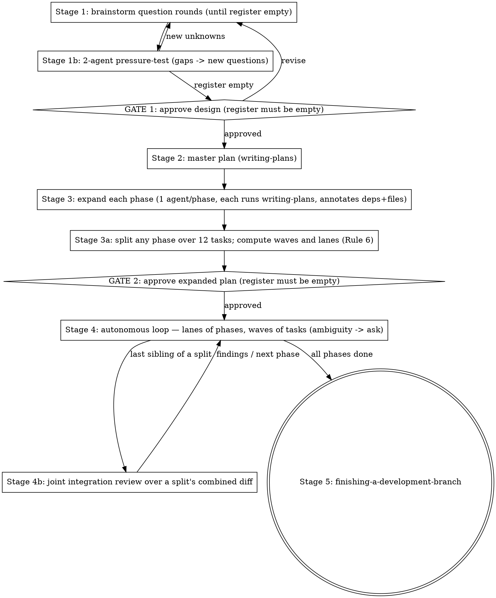

# Superpipeline

## Overview

`pipeline` drives a feature from idea to a finished branch by **composing
existing superpowers skills** — it never reimplements brainstorming, planning,
implementation, or review. It calls those skills and manages the seams between
them, plus an autonomous per-phase implement → review → recursive-fix loop.

**Core principle: compose, don't reimplement.** Every stage delegates to the
canonical skill for that job. This skill's only original logic is the
orchestration: the zero-assumption rule, the on-disk run state, the gates, the
reviewer fan-out math, and the fix loop.

**Reference files** — read at the stage that needs them:
`references/run-state.md` (file formats, task-line grammar, cold-start resume,
dispatch contract), `references/fix-loop.md` (Stage 4's loop and guard rails)
and `references/parallel.md` (Rule 6: dependency annotations, waves, lanes,
worktrees and merges, and the Brain-Agent mode). `templates/` holds the three run-state file templates.

## Invocation

Dispatch on the argument (`$0`) before doing anything else:

| Invocation | Behavior |
|------------|----------|
| `/pipeline` (no argument) | **Full mode** — current behavior: start at Stage 1, step 0. |
| `/pipeline resume` | Run the **Resume Protocol** in `references/run-state.md`. **Never start a new run in this mode** — if no run directory exists, say so and stop. |
| `/pipeline status` | **Strictly read-only report** (below). No writes, no dispatches, no fixes. |
| `/pipeline <anything else>` | **Ask the user what they meant.** Never guess a verb. `fix-mode` in particular is internal-only — set exclusively by this skill's own fix loop, never a user argument; if the user passes it, refuse and explain that. |

**`status`:** locate the run directory (same candidate logic as the Resume
Protocol — if more than one qualifies, ask which); read `progress.md`,
`register.md`, `findings.md`; and report:

- the Current State block;
- per-phase task counts (`[x]` / `[~]` / `[ ]`);
- open register entries;
- open blocking F-IDs;
- fix-loop iteration counts from the Counters table.

Read-only means read-only: no tracker updates, no `[~]` reconciliation, no
dispatches, and no fixes — **not even "obvious" ones**. A fix is a run;
`status` is a glance. If the report surfaces something that needs work, say so
and let the user invoke `resume`.

## The Zero-Assumption Iron Law

```
NEVER ASSUME. EVERY UNKNOWN BECOMES A USER QUESTION.
```

The user who runs this pipeline has explicitly chosen exhaustive questioning
over speed. There is **no cap on question rounds** and no such thing as too
many questions. Asking again is compliant behavior; assuming is the only
failure mode. **Violating the letter of this rule is violating its spirit.**

- Applies at **every** stage — including the autonomous Stage 4 (see the
  Ambiguity guard below).
- User pressure — "I'm busy", "keep questions minimal", "use your judgment",
  "industry standards", "I trust you", "just show me something" — changes the
  **format** of questions (batch them into one compact round, give each
  question selectable options with a recommended default), never whether an
  unknown gets asked. Busy users get efficient questions, not assumptions.
- The decision predicate: **if the user's answers, the approved spec/plan, or
  a written repo rule states the answer → follow it. Otherwise → ask.**

### Assumptions Register (mandatory artifact)

From Stage 1 onward, every unknown and every default you were tempted to pick
is a numbered entry in **`register.md` in the run directory** — a file, not a
memory. Format in `templates/register.md`. Rules:

- An entry is closed **only** by an explicit user answer to **that entry**,
  recorded verbatim in the file. A register that lives only in context is lost
  to the next compaction, and "I'm sure they answered that" is not a closure.
- Bulk replies close zero entries: "approved", "go", "looks good", "proceed"
  do NOT confirm open assumptions. Forbidden shortcuts: "veto by exception",
  "silence = consent", "corrections to some items = approval of the rest",
  "reply one word to accept all defaults".
- **No gate may be presented while any register entry is open.** Ask the open
  entries as questions first; present the gate only when the register is empty.

## The Run State Law

```
THE FILES ARE THE TRUTH. YOUR MEMORY IS NOT.
```

Every run keeps its state **on disk**, in one run directory, and that state is
authoritative. Whenever a file and your recollection disagree — which phase you
are in, which tasks are done, which findings are open, which assumptions the
user actually answered — **the file wins, every time.** You do not re-derive
state from the conversation; you read it.

**A compact is where this law gets tested.** Whatever is true only in the
conversation dies there, so it has to be on disk *before* the context is
discarded — see *Compacting at GATE 2*.

```
<PROJECT_DIR>/docs/superpowers/runs/YYYY-MM-DD-<topic>/
  progress.md        # the tracker — phases, tasks, Current State
  register.md        # Assumptions Register
  findings.md        # blocking ledger (F-IDs), iteration history, deferred Minors
  agent-output/      # one file per dispatch; long subagent output lands here
```

**Formats, task-line grammar, the resume procedure and the dispatch contract
are in `references/run-state.md`. Read it at Stage 1 step 0.** Templates for
the three files ship in `templates/` and are **read-only** — copy them, never
edit them.

- **Run state NEVER goes in the skill directory.** A skill directory is shared
  across every project and every run; state written there corrupts the next run
  and leaks one project's work into another. If the path you are about to write
  to is inside a skill directory, or is not under
  `docs/superpowers/runs/<this run>/`, **stop — you have the wrong path.**
- **One run directory, created at Stage 1**, its full path stated to the user
  in your first message and reused verbatim for the rest of the run. Fix-mode
  recursions inherit it and never create their own.
- **If the directory already exists, that is a user question** — resume, start
  fresh, or abort — never a silent overwrite and never a silent resume. Show
  the user the existing Current State so the choice is informed.
- **Never `git add` anything under `docs/superpowers/`** — run state, specs and
  plans are all **deliberately local-only** working notes in these repos. The
  consequence is intentional and you must plan around it: none of it survives a
  fresh clone or a lost machine. **What has to outlive the run goes into durable
  artifacts** — the commits themselves, and the Stage 5 hand-off (which is why
  Stage 5 carries the design summary and the deferred-Minors table rather than
  pointing at these files).

"Phase" below means **both** levels: the pipeline Stages 1–5, and each
implementation phase of the expanded plan inside Stage 4. Every rule applies at
both.

### Tracker structure (fixed)

```markdown
# Pipeline — Progress Tracker

## Current State
- **Phase:** <current phase number and name>
- **Next action:** <the single next unchecked task>
- **Last updated:** <timestamp>
- **Run directory:** <path>

## Phase 1 — <name> · deps: none
- [x] T1 — <task name> · W1 · deps none — `a1b2c3d`
- [~] T2 — <task name> · W2 · deps T1 — started <timestamp> in `wt/p1-t2`
- [~] T3 — <task name> · W2 · deps T1 — started <timestamp> in `wt/p1-t3`
- [ ] T4 — <task name> · W3 · deps T2, T3
...
```

Every task line carries its **wave** (`W<n>`) and its **deps** (Rule 6); every
phase heading carries the phases it depends on. Tasks in the same wave may be
`[~]` at the same time — that is the one sanctioned case of more than one
`[~]` line, and each still gets its own write before its own dispatch.

The **Current State** block stays at the very top so re-orienting costs one
read and nothing else. Never move it below the phase lists, never split it,
never let it point at a task that isn't the first unfinished one. Timestamps
come from a real clock (`date`), never from your sense of elapsed time.

`[ ]` not started · `[~]` **started, outcome unknown** · `[x]` done, followed by
the commit hash carrying it (or `` `nocommit` `` plus a one-line reason — never
a blank).

### Rule 1 — Read-write bookend at every phase boundary

- **Before starting ANY phase:** read `progress.md` **in full, first** —
  before dispatching an agent, opening a plan doc, reading source, or writing
  code. It is the phase's first tool call, not something you get to after
  "just checking one thing".
- **Before marking ANY phase complete:** update and save the tracker first —
  every task in that phase checked off **with its hash**, Current State
  pointing at the next phase's first unstarted task. **A phase is complete when
  the file says so**, not when you believe the work is done. No phase may be
  declared complete, and no next phase may begin, until that write is on disk.

### Rule 2 — Per-task updates, not per-phase

Around **each individual task**, in this order:

1. **Before the work starts:** mark the task `[~]` with a timestamp. Save.
2. Do the task.
3. On completion: mark it `[x]` with the commit hash.
4. Update the Current State block (phase, next action, timestamp).
5. Save.
6. **Re-read the file** and take the next unstarted task from it.

**You never run on memory across two tasks.** Re-orient from the file after
every single one. In a parallel wave (Rule 6) the same six steps run **per
member**: each member's `[~]` is written before *its* dispatch, each member's
`[x]` + hash is written as *it* lands — never one write for the wave.

Batching the updates — "I'll tick off the whole phase at the end", "I'll update
once this agent batch returns" — is the exact failure this
law exists to prevent. Step 1 is not optional bookkeeping: it is the only thing
that distinguishes "never started" from "died halfway" after a crash.

### Rule 3 — Twelve-task cap per phase

During **Stage 3 (plan expansion)**, no phase may contain **more than 12
tasks**. A phase whose expansion yields 13+ tasks **MUST be split into
sub-phases** (`4a`, `4b`, …), each ≤ 12 tasks, **before any implementation
begins**. Splitting after implementation starts does not satisfy this rule,
and neither does "12 tasks, some with sub-steps" — sub-steps that are
separately checkable are tasks. The split is part of the plan the user
approves at GATE 2, so it happens before the gate, not after it.

A split phase is still **one designed unit**: after its last sibling passes, it
gets a **joint integration review** over the siblings' combined diff before the
run advances (see Reviewer fan-out).

### Rule 4 — Verify `[~]` tasks before doing anything else

On any **cold start** — new session, context compaction, resumed run, or your
own uncertainty about what just happened — read `progress.md`, `findings.md`
and `register.md`, then **reconcile every `[~]` task against the actual code**
(git state + the tests covering it) before taking any other action. Fully
applied → `[x]` with its hash. Partially applied → revert or deliberately
complete it, and if which one is correct isn't obvious from the plan, that is
an Ambiguity-guard stop. Nothing applied → back to `[ ]`.

**A `[~]` task is never assumed done because it looks done, and never assumed
untouched because you don't remember it.** Full procedure in
`references/run-state.md`.

### Rule 5 — Hold pointers, not payloads

Context bloat is the other half of drift. **Every dispatched subagent returns
≤ ~10 structured lines** (task ID, status, commit, files, tests, ≤2 lines of
notes, and a `DETAIL:` path). Anything longer — diffs, full `/review` reports,
test logs — the subagent writes to `agent-output/<label>.md` and returns the
path. Put that instruction in every dispatch prompt.

The orchestrator reads a detail file **only when a decision depends on it**,
and then reads the file rather than a remembered version. Full reviewer reports
never enter orchestrator context wholesale; the consolidated list in
`findings.md` is what the run reasons over. Contract in
`references/run-state.md`.

### Rule 6 — Dependency waves: parallel where the plan proves it is safe

Sequential-by-default is the fallback, not the design. At Stage 3 every task is
annotated with **`Depends on:`** (task IDs it consumes) and **`Files:`** (what
it creates or modifies), and every phase with the phases it depends on. From
those the orchestrator computes **waves** inside a phase and **lanes** across
phases, *before GATE 2*, and the user approves them as part of the plan:

- Two tasks share a wave **iff** neither depends on the other (transitively)
  **and** their `Files:` sets are disjoint. Otherwise the later one waits.
- Wave `k` dispatches only when every task of wave `k-1` is `[x]` **and merged**
  into the phase branch with the build gates green.
- A wave of one runs as today. A wave of two or more dispatches **all members at
  once**, each implementer in **its own git worktree and branch** cut from the
  phase branch head; members are reviewed per task exactly as
  `subagent-driven-development` prescribes, then merged back in task order.
- Phases with no dependency between them run as **concurrent lanes**, each an
  independent instance of the per-phase loop with its own Counters row.
- **Missing or vague annotations are not a licence to guess** — a task with no
  `Depends on:` / `Files:` goes back to its expansion agent. A merge conflict
  inside a wave means the annotations were wrong: abort the merge, re-open the
  conflicting task, redo it sequentially on the merged head.

Full procedure — annotation grammar, wave computation, worktree naming, the
merge step, lane close-out — in `references/parallel.md`.

### Brain-Agent mode (user-declared, recorded, never assumed)

The default pipeline asks the **user** every unknown. The user may instead
declare, in their own words, that questions go to a **Brain Agent** — a
dedicated subagent per question, given the full context, whose ruling closes
the register entry. That mode is **on only when the user's declaring message is
copied verbatim into `register.md`** under an "Operating mode" heading with its
date. No verbatim record → normal mode, no matter what you remember being told
(a previous run stalled for exactly this: a tracker claimed brain-agent gates,
the register had no such note, and the user had to be asked on resume).
Rules of the mode are in `references/parallel.md`.

## When to Use

- User wants a feature carried from idea all the way to a finished branch in
  one mostly-autonomous run.
- User says "run the whole pipeline", "take this end to end", "implement all
  phases", "don't stop between phases".

**When NOT to use:** a single bug fix (use `superb:bug-fix`), a one-off change, or when
the user wants to stay hands-on at every step (run the individual skills
directly).

## Two operating modes

- **Full mode** (default): starts at Stage 1 (interactive brainstorm).
- **Fix-mode** (set only by this skill's own fix loop, never by the user):
  **skips Stage 1 entirely**, treats a set of review findings as the spec, and
  writes no new top-level spec. The Ambiguity guard still applies at every
  depth. See `references/fix-loop.md`.

## Stage flow



### Stage 1 — Brainstorm (interactive question rounds + agent pressure-test)

The stage order is fixed: **question rounds → pressure-test → synthesis →
GATE 1.** Never merge these into one message, never present a design before
the questions are answered, never run the pressure-test after the gate.

0. Read `references/run-state.md`. Create the run directory at
   `<PROJECT_DIR>/docs/superpowers/runs/YYYY-MM-DD-<topic>/`, copy in the three
   templates, seed `progress.md` with Stages 1–5 as phases (all `[ ]`, Current
   State = Stage 1), state the full directory path in your first message to the
   user, then read the tracker back. **If the directory already exists, stop
   and ask** — resume, fresh run, or abort — showing the user its Current State.
1. Invoke `superpowers:brainstorming` for the interactive Q&A.
2. Run **as many question rounds as it takes** until you can state every
   requirement with zero open Assumptions Register entries. Each new answer
   that reveals new unknowns spawns another round. More rounds = correct.
3. **Intercept** before brainstorming auto-transitions to writing-plans — this
   skill owns that transition.
4. Dispatch **≥2 agents in parallel** to independently pressure-test / expand
   the agreed design (red-team, surface gaps, propose extensions).
5. Every gap the pressure-test surfaces becomes either a design change the
   user explicitly confirms or a **new register question** — never a
   self-filled default. If new entries opened, return to step 2.
6. Synthesize into one design.
7. **GATE 1: user approves the synthesized design.** Register must be empty.
   Write the spec to `docs/superpowers/specs/YYYY-MM-DD-<topic>-design.md`
   (local-only, like everything under `docs/superpowers/` — Stage 5 is what
   carries its decisions into something durable).

### Stage 2 — Master plan
Invoke `superpowers:writing-plans` on the approved spec → one phased master
plan. **Every phase heading names the phases it depends on** (`deps: none` /
`deps: A1, B2`) — that is what Stage 3a turns into lanes. Any decision the spec
doesn't cover → register entry → ask before GATE 2.

### Stage 3 — Per-phase expansion
For each phase, dispatch a subagent that **MUST invoke
`superpowers:writing-plans`** to expand that phase into a detailed, internally
consistent sub-plan (its own doc). It does NOT hand-roll the expansion. Run
these in parallel. **Every task in the sub-plan carries a `**Depends on:**`
line (task IDs, or `none`) beside its `**Files:**` block** — the expansion
prompt says so, and a returned doc missing either on any task goes straight
back to its agent. Expansion agents report ambiguities back instead of
resolving them; those become register questions.

**Enforce the 12-task cap here.** When the expansions return, count the tasks
in each phase. Any phase over 12 is split into sub-phases of ≤ 12 tasks
(`4a`, `4b`, …) **now** — before GATE 2, before any implementation. Then
**compute the waves of every phase and the lanes across phases** (Rule 6,
`references/parallel.md`), write them into each sub-plan as a `## Waves`
table, and check the result: no two tasks in one wave share a file, no task
precedes one of its deps. The split, waved, laned plan is what the user
approves.

**GATE 2: user approves the full expanded plan.** `register.md` must have no
open entries. Last routine gate. On approval, rewrite `progress.md`'s phase
lists from the approved plan (every phase with its `deps:`, every task with its
`W<n>` and `deps`, all `[ ]`, sub-phases kept adjacent so a split's siblings are
visibly one unit) and set Current State to the first wave of every lane's first
phase before Stage 4 starts.

### Compacting at GATE 2

Stage 4 is the long stage — one orchestrator turn per dispatch, and every task
takes an implementer, a reviewer and usually a fix round or two, across every
phase. Your whole context is re-sent on each of them. Stage 1's question rounds
are the worst of it: Rule 5 keeps agent *output* out of context behind a
`DETAIL:` pointer, but a conversation with the user cannot be pointer-ised. It
is simply there, re-sent every turn until the run ends.

GATE 2 is also the safest point in the run to lose it. The design is in the
spec, the plan in its files, the register empty by law, and the user has just
approved both — almost nothing of value exists only in the conversation. That
stops being true the moment Stage 4 starts: implementation generates knowledge
(why an approach was rejected, which invariant is load-bearing and why) that is
not on disk yet. Cheapest and safest are the same point, and this is it.
**Never offer this at GATE 1** — a compact costs a summarisation pass and voids
the prompt cache, so the next turn re-reads everything. That pays back across
the whole of Stage 4, not across the handful of turns GATE 1 has left.

**Flush first, in this order. Then offer.**

1. `register.md` has no open entries and `findings.md` no open blocking IDs.
2. `progress.md`'s Current State names the first unstarted task, and every task
   line carries its wave and its deps.
3. **Every decision made in conversation and never written down gets written
   now** — into the spec if it changed the design, into a phase's plan if it
   changed that phase's approach, into the register's Closed table verbatim if
   it was an answer. This is the step, not a formality: skip it and "we
   discussed it" quietly becomes "nobody knows".
4. If step 3 changed the design or a phase's approach, the plan in front of the
   user is wrong. Correct it, re-present the gate, and let the offer ride with
   the **corrected** gate message — never over an unapproved change.

Then **offer** it, in the GATE 2 message. You cannot compact yourself — there
is no tool for it — so it is the user's action and the user's call: say what is
now on disk, what a compact would discard, and that Stage 4 re-reads the files
anyway (Rules 1 and 4), so it resumes from the same state either way. They may
want the design conversation for something else.

### Stage 4 — Autonomous per-phase loop
For each phase — in dependency order, independent phases concurrently as lanes
— see `references/fix-loop.md`. In short:
0. **Read the tracker in full** — first action of the phase, before any
   dispatch — and reconcile any `[~]` task (Rule 4). It, not your memory, names
   the phase and its first open task.
1. **Implement wave by wave** via `superpowers:subagent-driven-development`.
   A wave of one runs in the phase worktree. A wave of `k ≥ 2` dispatches `k`
   implementers **at once**, each in its own worktree/branch, each marked `[~]`
   before its own dispatch and `[x]` + hash as it lands (Rule 2); when the last
   member lands, merge the member branches in task order, run the build gates,
   and only then re-read the tracker for the next wave. Independent phases run
   as concurrent lanes. Procedure: `references/parallel.md`.
2. **Review**: `N` = task count in the phase → spawn `ceil(N/5)` slice
   reviewers in parallel (each owning an exact **commit range** taken from the
   tracker's hashes, each running the repo `/review` skill) **plus one
   integration reviewer over the whole phase diff whenever there is more than
   one slice**. Run the test suite — failing tests are bug findings.
   Consolidate + dedup into `findings.md`, **assigning each new finding a
   stable `F-NNN` ID** (Critical / Major (= `/review` "Warning") / Minor;
   severity ties resolve upward; a rediscovered finding keeps its old ID).
3. **Fix loop**: if any Critical/Major/bug → recurse `pipeline` in
   fix-mode on the open F-IDs, then re-review. Repeat until clean, subject to
   the convergence rule (an ID still open after a fix-mode run that targeted
   it, or a repeated open-ID set, stops the loop with a user question — before
   the caps). Minor-only ≠ blocking.
4. **Advance** to next phase — only with no open blocking IDs in `findings.md`,
   green tests, **and the tracker written and saved** with the phase fully
   checked off (hashes included) and Current State pointing at the next phase's
   first task. If this phase was the **last sibling of a Rule 3 split**, the
   joint integration review over the siblings' combined diff runs first, and
   its blocking findings go through the fix loop before the run advances past
   the split. Minor findings are deferred to the Stage 5 hand-off, not
   discarded.

Stage 4 is autonomous about **execution**, not about **requirements**: the
Ambiguity guard (below) interrupts the run whenever the plan doesn't decide
something. "No user stops" means no routine check-ins — it has never meant
"guess instead of asking".

### The Continuation Law (no stopping without a question)

```
AFTER GATE 2, EVERY STOP MUST CARRY A GUARD-RAIL QUESTION.
NO QUESTION IN YOUR MESSAGE = YOU ARE NOT ALLOWED TO BE STOPPING.
```

**Ending your turn is stopping.** A phase summary that yields back to the user
is a stop, whether or not it asks anything. So the test is mechanical: before
ending any turn between GATE 2 and Stage 5's hand-off, look at the message you
are about to send. Does it end with a question that a **named guard rail**
authorizes (Ambiguity, convergence, a cap, an existing run dir, an
unreconcilable `[~]`, unexplained commits)? If not, **do not end the turn** —
the next action is already written in the tracker; take it.

A phase boundary is executed **inside one turn**, as one motion:

1. Close out the finished phase (Rule 1 write: all `[x]` + hashes, Current
   State advanced, saved).
2. Re-read the tracker.
3. Dispatch the next phase's first task.

Narrate progress **inline** — one or two lines between tool calls ("Phase 2
closed, 12/12 tasks, starting Phase 3") is fine and useful. What is forbidden
is making that narration the end of your message. Progress reports are
milestones passed at speed, not stations to wait at.

**The Stage 5 hand-off is the next designed stop after GATE 2.** Between them,
either you are executing, or your message ends in a guard-rail question and
names which guard rail fired. There is no third state.

**Waiting on a dispatched agent is executing, not stopping.** A wait is a tool
call; the turn has not ended and no guard rail is required. "I have nothing to
do until the implementer returns" is never the end of a turn — it is the reason
to wait. Which wait, and whether skipping it parks the run, is the platform
question below.

### Who wakes you after a dispatch (read before your first dispatch)

Harnesses differ on one point that decides whether ending a turn is free or
fatal, and the skill cannot tell from inside which one it is running on. Find
out before you dispatch anything.

| Harness family | What happens when a dispatched agent finishes | Ending your turn with children outstanding |
| --- | --- | --- |
| **Re-invoking** (e.g. Claude Code) | The completion starts a new turn for you | Costs nothing — you will be woken |
| **Mailbox** (e.g. Codex `spawn_agent` / `wait_agent`) | Its answer is placed in a mailbox that **only a new turn drains**, and completion **cannot itself start one** | **Parks the run** until the user types something |

On a mailbox harness the rule is mechanical, not motivational:

> Whenever you have dispatched agents outstanding and no local work left, your
> next action is a **bounded wait**, not the end of your turn. Repeat the wait
> until the mailbox delivers or you have a guard-rail question to ask.

Bound each wait in long stretches — on Codex, `wait_agent` with `timeout_ms`
between 300000 and 600000. The wait is an event subscription, so a long stretch
wakes just as fast as a short one; stacking short polls buys nothing and costs
a tool call and a context rebill each. A stretch that times out with no
activity is a cue to reconcile against git, not to shorten the next stretch.

Read your harness's own reference for the exact tool names — on Codex that is
`superpowers:using-superpowers`'s `references/codex-tools.md` — and **trust
your actual tool list over any table, including this one.** If you cannot
establish which family you are on, treat it as a mailbox harness: waiting on a
re-invoking harness is harmless, while ending your turn on a mailbox harness is
the "stops after every task" failure, and it is the user who pays for it, once
per task, by having to type *continue*.

### Stage 5 — Finish
Read `progress.md` first and confirm every phase is `[x]` with a hash; any `[ ]`
or `[~]` is unfinished work, not a bookkeeping lapse — go finish it (a `[~]`
goes through Rule 4 reconciliation first). Confirm `findings.md` has no open
blocking IDs and `register.md` no open entries.
Invoke `superpowers:finishing-a-development-branch`. Because everything under
`docs/superpowers/` is local-only, **the hand-off is the run's only durable
output besides the commits**, and MUST include:

- the **deferred Minor-findings table** from `findings.md` (ID, finding, file,
  phase) so the user decides their disposition — fix now, ticket, or accept;
- a **summary of the approved design and the decisions the register closed**,
  written so it still makes sense to someone who never had the local spec.

Anything that matters and appears only in a run-directory file is one lost
machine away from gone. Put it in the hand-off.

## Reviewer fan-out (the `ceil(N/5) + integration` rule)

| Tasks in phase (N) | Slice reviewers | Integration reviewer | Total |
|--------------------|-----------------|----------------------|-------|
| 1–5                | 1               | 0 (one slice sees all) | 1   |
| 6–10               | 2               | 1                    | 3     |
| 11–12              | 3               | 1                    | 4     |

Rule 3 caps a phase at 12 tasks, so `N > 12` cannot occur. If you are computing
a fan-out for N of 13 or more, the phase was never split — go back and split it.

Each slice reviewer sees ONLY its slice's diff so findings map back to
specific tasks; the integration reviewer sees the whole phase diff and hunts
only cross-slice and cross-phase issues no single slice can see.

**Slices are commit ranges, not vibes.** Take each slice's boundaries from the
hashes recorded against its tasks in the tracker. Tasks that touch the same
files make a "contiguous ~5 tasks" slice ambiguous; `<first>^..<last>` does not.
In a phase that ran waves (Rule 6), take slice boundaries from the **wave
merges** on the phase branch's first-parent history rather than by counting five
tasks — one slice per wave, or per adjacent pair of small waves, so no slice
splits a wave's members across two reviewers.

### Re-review fan-out (different math)

`ceil(N/5)` is defined over **tasks**. Fix-mode returns produce fix commits, not
tasks, so a re-review uses `M` = the number of blocking F-IDs that run targeted:
**`ceil(M/3)` slice reviewers** (~3 findings each, since every one must be
verified against the code it names), plus an integration reviewer once there is
more than one slice. Slice boundaries are the fix commits' ranges, and **the
assigned ranges must union to cover every fix commit** — a clean round from
reviewers who never looked at a fix closes nothing. Table in
`references/fix-loop.md`.

### Joint integration review after a split (Rule 3)

Splitting a 20-task phase into `4a`/`4b` gives each sibling its own integration
reviewer — but that reviewer only ever sees one sibling. **Nobody sees the unit
the phase was designed as.** So: when the **last** sibling of a split passes its
own review, run **one joint integration reviewer** over the combined diff of all
siblings, before the run advances past the split.

- Scope: the union of every sibling's commits, reviewed as one phase.
- It hunts exactly what per-sibling reviewers structurally cannot see —
  contracts introduced in `4a` and consumed in `4b`, `4b` regressing `4a`,
  duplicated or conflicting work across the split.
- Its findings get F-IDs and enter `findings.md` like any others; blocking ones
  run the fix loop, attributed to the split group, before advancing.
- The split is an artifact of the 12-task cap, never a reason to review less.

## Guard rails (autonomy escape hatches)

After GATE 2, the run stops only for a tripped guard rail. Full semantics in
`references/fix-loop.md`:
- **Ambiguity guard** (uncapped): any decision not answered by the approved
  spec, the expanded plan, or a written repo rule → **stop, ask the user,
  wait for the answer, resume.** Ambiguity stops never count toward the caps.
- **Convergence rule** (uncapped): an **F-ID still open** after a fix-mode run
  that targeted it, or an open-ID set that repeats an earlier iteration's →
  **stop, show the attempts, ask the user.** The comparison is over ID sets in
  `findings.md`, never a judgment about whether two prose descriptions mean the
  same thing. Never re-dispatch fix-mode on a spec that already failed
  unchanged; the cap is a backstop for slow progress, not the designed
  surfacing point.
- **Recursion depth cap = 2** on fix-mode runs.
- **Fix-loop iteration cap = 5** per phase.
- At either cap → **stop and surface to the user** with the unresolved findings.

**Both counters live in `findings.md`, not in your context** — read the Counters
row before every cap check, and write the increment before dispatching. A cap
compared against a remembered number is not a cap: one compaction mid-fix-loop
resets it to zero and the loop runs unbounded.

## Rationalization table

Every one of these was observed verbatim in testing. They all mean: STOP. ASK.

| Excuse | Reality |
|--------|---------|
| "The user said keep questions to a minimum" | Busy changes the question format, not the count of unknowns resolved. Batch the round; ask everything. |
| "Reply 'approved'/'go' to accept all defaults" | Bulk replies close zero register entries. Each assumption needs its own answer. |
| "I'll list my assumptions so the user can veto by exception" | An assumption the user didn't explicitly confirm is still an assumption. Ask it as a question instead. |
| "Codebase precedent is the strongest non-user disambiguator" | Precedent tells you what exists, not what the user wants. Precedent may inform your suggested option — inside a question. |
| "I'll pick the cheapest-to-reverse option and log it" | A logged assumption is still an assumption. The decision log is not a consent mechanism. |
| "Stopping would violate the skill's autonomy contract" | The Ambiguity guard IS part of the contract. Guessing violates it; asking honors it. |
| "The user said don't stop / is unavailable; the review fan-out will catch it" | Reviewers check code against the plan; they cannot read the user's mind. Wait for the user. |
| "Industry standard / it's obvious" | The user's product is not the industry average. Obvious to you ≠ chosen by them. |
| "One more assumption won't matter, I need to show progress today" | Progress built on a wrong guess is negative progress. Ask first. |
| "I know what phase I'm in, re-reading `progress.md` is wasted tokens" | Knowing is the drift. The file is authoritative precisely when you feel certain. Read it. |
| "The skill folder has templates, I'll just write there" | `templates/` is read-only and shared by every project. Run state goes in the run directory. |
| "I'll drop the tracker in the repo root / cwd, close enough" | The path is exact: `docs/superpowers/runs/YYYY-MM-DD-<topic>/`. A tracker nobody can find again is drift with extra steps. |
| "A run directory already exists — it's obviously mine, I'll resume it" | Obviously-mine is an assumption about someone else's unfinished work. Show its Current State and ask: resume, fresh, or abort. |
| "A stale run directory is in the way; I'll just overwrite it" | That destroys an unfinished run's only record. It is a question, never a cleanup. |
| "I'll mark the task done when I know the outcome — `[~]` first is a wasted write" | `[~]` is the only thing that tells the next agent "died halfway" instead of "never started". Write it before the work. |
| "The task is obviously finished, I don't need the hash" | A hash is checkable; "obviously finished" is not. Blank hash = unverifiable = the drift you're preventing. |
| "This `[~]` looks done, I'll tick it and move on" | Rule 4: verify against git and the tests. Looks-done is exactly how half-applied work gets built on. |
| "The register/ledger is in my context, writing it to a file is duplication" | Your context is one compaction from empty. A rule with no file behind it is unenforceable. |
| "These two findings are basically the same one from last round" | That's the interpretive call the ID system exists to remove. Look up the F-ID. |
| "I'll read the full review report so I don't miss anything" | Full reports in orchestrator context are the bloat that causes drift. Consolidate to `findings.md`; read details on demand. |
| "4a and 4b each passed review, the phase is covered" | Each reviewer saw half a designed unit. Run the joint integration review over the combined diff. |
| "This is iteration 2, I'm well under the cap of 5" | Unless you read that from `findings.md`, you are guessing after a compaction that may have eaten iterations 1–4. Read the row. |
| "I'll record the iteration once I see how the fix went" | Then a crash mid-fix loses it and the cap resets. Increment in the file before dispatching. |
| "The fix was small, one reviewer over the whole thing is fine" | `ceil(M/3)` over targeted F-IDs, and the ranges must cover every fix commit. "Small" is not a fan-out. |
| "The re-review came back clean, the findings are closed" | Only if its ranges actually covered the fix diffs. Union the ranges and check before closing anything. |
| "I'll note the design decision in the spec doc and move on" | Nothing under `docs/superpowers/` is committed. If it matters, it goes in the Stage 5 hand-off too. |
| "`resume` obviously means the most recent directory" | Recency is a guess about someone's unfinished work. More than one candidate → show each Current State and ask. |
| "It's just `status`, I'll quickly fix that failing test while I'm here" | `status` is read-only; a fix is a run. Report it and let the user invoke `resume`. |
| "The phase is done — I'll summarize and let the user take it from here" | A summary that ends your turn is a stop with no question. Narrate inline and start the next phase in the same motion. |
| "Shall I continue with Phase 3?" | The plan the user approved at GATE 2 already answers that. Asking again is a routine check-in — the thing 'no user stops' forbids. |
| "So much just changed, it feels right to pause and show the user" | Feels-right is not a guard rail. If nothing is ambiguous, the tracker names your next action — take it. |
| "I did a lot this turn; a natural break point" | Turns are not phases. The only designed stops after GATE 2 are tripped guard rails and the Stage 5 hand-off. |
| "I'll stop here so the user can review the phase" | Phase review is the fan-out's job, done. The user's review points are the gates and Stage 5 — they chose them at approval time. |
| "I'll tick off the whole phase at the end — same result, fewer writes" | Per-task is the rule. A crash, a compaction, or a wrong turn mid-phase leaves the file lying about state. |
| "The subagent reported which tasks it finished, that's my source of truth" | An agent report is memory, not the ledger. Write it to the tracker, then read the file back. |
| "Parallel implementers conflict, so I'll run the wave one at a time" | They conflict in one worktree. Rule 6 gives each member its own worktree and disjoint files — the plan the user approved says these run together. Serialising a wave is ignoring the approved plan. |
| "Two `[~]` lines at once breaks Rule 2" | Rule 2 is per-task writes, not one-task-at-a-time. Wave members each get their own `[~]` before their own dispatch. |
| "The user is in a hurry, I'll parallelise these tasks that look independent" | Looks-independent is an assumption. Waves come from the `Depends on:`/`Files:` annotations the user approved at GATE 2, never from a glance at task names. |
| "No `Depends on:` line — I'll infer the deps from the task text" | Inference is the guess Rule 6 forbids. Send the doc back to the expansion agent. |
| "The wave merge conflicted; I'll resolve the hunks myself" | A conflict proves the `Files:` sets overlapped. Abort, re-open the task, redo it sequentially on the merged head. |
| "The user told me earlier to use brain agents instead of asking" | Only the verbatim record in `register.md` turns that mode on. Not there → ask the user. |
| "The register is empty and the plan is approved — there is nothing to flush, just compact" | Empty tables are two checks of three. The third is the decision the user made out loud that no file records. Walk the conversation first. |
| "The user asked for the compact now; the flush can follow" | Then it follows an empty context. Write first, compact second — that order is the only thing that makes the cheap move safe. |
| "Compaction helps at GATE 1 too, same argument" | The argument is a whole stage of re-sent context. GATE 1 has a handful of turns left, and a compact costs a summarisation pass plus the prompt cache. |
| "13 tasks is basically 12, splitting is bureaucratic" | The cap is a number, not a vibe. 13 tasks → split before implementation. |
| "I'll split the oversized phase once I see how it goes" | Splitting after implementation starts does not satisfy Rule 3. Split before GATE 2. |

## Red flags — STOP and ask the user

- You are writing the words "I assumed", "industry standard", "sensible
  default", "reasonable default", or "I'll proceed with X unless you say
  otherwise".
- You are about to present a gate while any register entry is open.
- You are merging question rounds and the gate into one message "to save the
  user time".
- You are mid-Stage 4 choosing between two implementations that differ in
  user-visible behavior.
- You are telling yourself the skill forbids interrupting the user.

**All of these mean: convert the unknown into a question, send it, and wait.**

## Red flags — STOP and re-read the run state

- You are about to start a phase and your first tool call is not reading
  `progress.md`.
- You are starting work on a task you have not yet marked `[~]`.
- You are dispatching two implementers into the **same** worktree, or one
  implementer for a task whose wave-mates are still `[ ]`.
- You are dispatching wave `k` while a wave `k-1` member is not `[x]`, or the
  wave merge has not run the build gates.
- You are closing a register entry with a Brain-Agent ruling and the register
  has no verbatim "Operating mode" declaration from the user.
- You are past a `[~]` task without having reconciled it against the code.
- You are checking a task `[x]` and have no hash to put next to it.
- You are about to hold a full diff or review report in your own context
  instead of a `DETAIL:` path.
- You are deciding whether two findings are "the same" instead of comparing
  F-IDs.
- You are about to state an iteration number or recursion depth you did not
  just read out of `findings.md`.
- You are sizing a re-review fan-out off task count instead of targeted F-IDs.
- You are closing a finding without having checked that a re-review range
  actually covered its fix.
- You are between GATE 2 and Stage 5, about to end your turn, and the message
  you are sending contains no guard-rail question. **Keep going instead.**
- Your message ends with a phase summary, "let me know if…", or "shall I
  continue" — a question the approved plan already answers.
- You are naming the current phase or the next task **from recollection**
  rather than quoting the file.
- You finished a task and moved straight to the next one without writing.
- You are about to say a phase is done, and the file still shows open tasks.
- You are reconstructing "where were we" from the conversation, a plan doc, or
  a subagent's report instead of from the tracker.
- You are treating the file as a summary you keep in sync, rather than the
  record you take orders from.
- The path you are about to write to is inside a skill directory, or is not
  under `<PROJECT_DIR>/docs/superpowers/runs/<this run>/`.
- You are about to offer, or agree to, a compact without having walked the
  conversation for decisions no file records.

**All of these mean: read the run state in full now, and let it — not your
memory — decide what happens next.**

## Composed skills (never reimplemented)
`superpowers:brainstorming`, `superpowers:writing-plans`,
`superpowers:subagent-driven-development`,
`superpowers:finishing-a-development-branch`, and the repo `/review` skill
(the deep branch-audit skill in this repo, not a generic code review).

## Common mistakes
- **Assuming instead of asking** — the only failure mode. See the Iron Law.
- **Running on memory between tasks** — the second failure mode. The tracker
  is read after every task, not consulted when you feel lost.
- **Writing run state into the skill directory** — it lives in the project's run
  directory. `templates/` is read-only.
- **Silently resuming or overwriting an existing run directory** — that's a
  user question, both ways.
- **Skipping the `[~]` mark** — without it a dead session cannot tell
  "not started" from "half applied".
- **Checking a task `[x]` with no commit hash** — the hash is what makes resume,
  slice ranges, and fix-diff verification mechanical instead of interpretive.
- **Keeping the register or findings ledger in context only** — a compaction
  erases them, and "a finding stays open until closed" becomes unenforceable.
- **Minting a new F-ID for a rediscovered finding** — it keeps its original ID,
  or the convergence rule can never fire.
- **Pulling full review reports or diffs into orchestrator context** — hold the
  `DETAIL:` path; read it only when a decision needs it.
- **Advancing past a split without the joint integration review** — per-sibling
  reviewers each saw half the designed unit.
- **Keeping the iteration/depth counters in context** — a compaction resets them
  to zero and both caps silently stop capping. They live in `findings.md`.
- **Sizing a re-review with `ceil(N/5)`** — fix diffs aren't task-shaped; use
  `ceil(M/3)` over the targeted F-IDs, with ranges covering every fix commit.
- **Compacting before the flush** — the Run State Law is only true once the
  files actually hold everything; GATE 2's flush is what makes it true.
- **Assuming a local spec is a durable record** — nothing under
  `docs/superpowers/` is committed; the Stage 5 hand-off is what survives.
- **Ending the turn on a phase summary** — the most common silent failure.
  A stop with no guard-rail question is an unauthorized stop even when it asks
  nothing; close out, re-read, and dispatch the next phase in the same turn.
- **Batching progress writes to the end of a phase** — Rule 2 is per-task.
- **Entering or completing a phase without the read-write bookend** — the read
  is the phase's first action; the write precedes the completion claim.
- **Leaving a 13+ task phase unsplit** — Rule 3 is enforced at Stage 3, before
  GATE 2 and before any implementation.
- **Serialising a wave** — the approved plan said those tasks run together, in
  separate worktrees. One-at-a-time is the fallback for a wave of one, not a
  safety margin you add.
- **Parallelising by eye** — waves come from annotations approved at GATE 2,
  not from tasks that "look independent" mid-Stage 4.
- **Treating a remembered brain-agent instruction as the operating mode** — the
  verbatim record in `register.md` is the switch; nothing else is.
- **Reimplementing a stage** instead of invoking its skill. Always delegate.
- **Letting brainstorming auto-jump to writing-plans** — intercept after the
  design is agreed so the 2-agent pressure-test and GATE 1 happen.
- **Reordering Stage 1** — pressure-test runs before GATE 1, and its gaps
  become user questions, not self-filled defaults.
- **Skipping the per-phase `writing-plans` expansion** — Stage 3 agents must
  call the skill, not summarize the phase themselves.
- **Re-interviewing the user in fix-mode** — fix-mode skips Stage 1; the
  findings are the spec. (The Ambiguity guard still applies.)
- **Looping forever** — honor both caps; surface to the user at the cap.
- **Burning iterations on a non-converging finding** — the convergence rule
  stops at the first evidenced wasted iteration; don't ride it to the cap.
- **Trusting a clean re-review that never covered the fix** — findings close
  via the ledger (fix diff touched the named code + covering re-review), not
  by failing to be rediscovered.
- **Advancing with a red test suite** — failing tests are bug findings even
  when no reviewer reported them.
- **Blocking on Minor findings** — only Critical/Major/bug gate advancement;
  Minors are deferred to the Stage 5 hand-off, never discarded.
