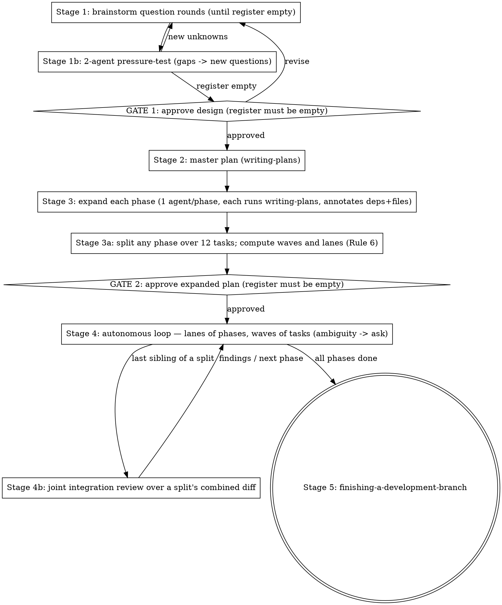

# Superpipeline

## Overview

`pipeline` drives a feature from idea to a finished branch by **composing
existing superpowers skills** — it never reimplements brainstorming, planning,
implementation, or review. It calls those skills and manages the seams between
them, plus an autonomous per-phase implement → review → recursive-fix loop.

**Core principle: compose, don't reimplement.** Every stage delegates to the
canonical skill for that job. This skill's only original logic is the
orchestration: the zero-assumption rule, the on-disk run state, the gates, the
reviewer fan-out math, and the fix loop.

**Reference files** — read at the stage that needs them:
`references/run-state.md` (file formats, task-line grammar, cold-start resume,
dispatch contract), `references/fix-loop.md` (Stage 4's loop and guard rails)
and `references/parallel.md` (Rule 6: dependency annotations, waves, lanes,
worktrees and merges, and the Brain-Agent mode). `templates/` holds the run-state file templates.

## Invocation

Dispatch on the argument below, before doing anything else. An empty argument
means Full mode. Ignore any whitespace around the argument.

`$ARGUMENTS`

That is the whole argument string. **Never key this table on an indexed
placeholder.** `\$0` is the first positional argument and it does get substituted —
but an indexed placeholder with no argument at its position is left in the prompt
verbatim, so a bare invocation renders a stray literal `\$0` into exactly the arm
this table calls "no argument". `\$ARGUMENTS` expands to the whole argument string
as typed, so it has no such hole. Every mention of a placeholder in this file that
is *not* the dispatch target above is backslash-escaped for that reason: an
unescaped one would be substituted too, and would rewrite the very text that
documents it.

| Invocation | Behavior |
|------------|----------|
| `/superb:pipeline` (empty `\$ARGUMENTS`) | **Full mode** — start at Stage 1, step 0. |
| `/superb:pipeline resume` | Run the **Resume Protocol** in `references/run-state.md`. **Never start a new run in this mode** — if no run directory exists, say so and stop. |
| `/superb:pipeline status` | **Strictly read-only report** (below). No writes, no dispatches, no fixes. |
| `/superb:pipeline <anything else>` | **Ask the user what they meant.** Never guess a verb. `fix-mode` in particular is internal-only — set exclusively by this skill's own fix loop, never a user argument; if the user passes it, refuse and explain that. |

**`status`:** locate the run directory (same candidate logic as the Resume
Protocol — if more than one qualifies, ask which); read `progress.md`,
`register.md`, `findings.md`; and report:

- the Current State block;
- per-phase task counts (`[x]` / `[~]` / `[ ]`);
- **every phase's `RV` state, and any `RVJ`** — an open `RV` under a phase whose
  tasks are all `[x]` is the headline of the report, not a footnote: that phase
  was implemented and never reviewed;
- open register entries;
- open blocking F-IDs;
- fix-loop iteration counts from the Counters table.

Read-only means read-only: no tracker updates, no `[~]` reconciliation, no
dispatches, and no fixes — **not even "obvious" ones**. A fix is a run;
`status` is a glance. If the report surfaces something that needs work, say so
and let the user invoke `resume`.

## The Zero-Assumption Iron Law

```
NEVER ASSUME. EVERY UNKNOWN BECOMES A USER QUESTION.
```

The user who runs this pipeline has explicitly chosen exhaustive questioning
over speed. There is **no cap on question rounds** and no such thing as too
many questions. Asking again is compliant behavior; assuming is the only
failure mode. **Violating the letter of this rule is violating its spirit.**

- Applies at **every** stage — including the autonomous Stage 4 (see the
  Ambiguity guard below).
- User pressure — "I'm busy", "keep questions minimal", "use your judgment",
  "industry standards", "I trust you", "just show me something" — changes the
  **format** of questions (batch them into one compact round, give each
  question selectable options with a recommended default), never whether an
  unknown gets asked. Busy users get efficient questions, not assumptions.
- The decision predicate: **if the user's answers, the approved spec/plan, or
  a written repo rule states the answer → follow it. Otherwise → ask.**

### Assumptions Register (mandatory artifact)

From Stage 1 onward, every unknown and every default you were tempted to pick
is a numbered entry in **`register.md` in the run directory** — a file, not a
memory. Format in `templates/register.md`. Rules:

- An entry is closed **only** by an explicit user answer to **that entry**,
  recorded verbatim in the file. A register that lives only in context is lost
  to the next compaction, and "I'm sure they answered that" is not a closure.
- Bulk replies close zero entries: "approved", "go", "looks good", "proceed"
  do NOT confirm open assumptions. Forbidden shortcuts: "veto by exception",
  "silence = consent", "corrections to some items = approval of the rest",
  "reply one word to accept all defaults".
- **No gate may be presented while any register entry is open.** Ask the open
  entries as questions first; present the gate only when the register is empty.

## The Run State Law

```
THE FILES ARE THE TRUTH. YOUR MEMORY IS NOT.
```

Every run keeps its state **on disk**, in one run directory, and that state is
authoritative. Whenever a file and your recollection disagree — which phase you
are in, which tasks are done, which findings are open, which assumptions the
user actually answered — **the file wins, every time.** You do not re-derive
state from the conversation; you read it.

**A compact is where this law gets tested.** Whatever is true only in the
conversation dies there, so it has to be on disk *before* the context is
discarded — see *Compacting at GATE 2*.

```
<PROJECT_DIR>/docs/superpowers/runs/YYYY-MM-DD-<topic>/
  progress.md        # the tracker — phases, tasks, Current State
  register.md        # Assumptions Register
  findings.md        # blocking ledger (F-IDs), iteration history, deferred Minors
  kit.md             # the run's shared verification apparatus (written at GATE 2)
  agent-output/      # one file per dispatch; long subagent output lands here
```

**Formats, task-line grammar, the resume procedure and the dispatch contract
are in `references/run-state.md`. Read it at Stage 1 step 0.** Templates for
the templates ship in `templates/` and are **read-only** — copy them, never
edit them.

- **Run state NEVER goes in the skill directory.** A skill directory is shared
  across every project and every run; state written there corrupts the next run
  and leaks one project's work into another. If the path you are about to write
  to is inside a skill directory, or is not under
  `docs/superpowers/runs/<this run>/`, **stop — you have the wrong path.**
- **One run directory, created at Stage 1**, its full path stated to the user
  in your first message and reused verbatim for the rest of the run. Fix-mode
  recursions inherit it and never create their own.
- **If the directory already exists, that is a user question** — resume, start
  fresh, or abort — never a silent overwrite and never a silent resume. Show
  the user the existing Current State so the choice is informed.
- **Never `git add` anything under `docs/superpowers/`** — run state, specs and
  plans are all **deliberately local-only** working notes in these repos. The
  consequence is intentional and you must plan around it: none of it survives a
  fresh clone or a lost machine. **What has to outlive the run goes into durable
  artifacts** — the commits themselves, and the Stage 5 hand-off (which is why
  Stage 5 carries the design summary and the deferred-Minors table rather than
  pointing at these files).

"Phase" below means **both** levels: the pipeline Stages 1–5, and each
implementation phase of the expanded plan inside Stage 4. Every rule applies at
both.

### Tracker structure (fixed)

```markdown
# Pipeline — Progress Tracker

## Current State
- **Phase:** <current phase number and name>
- **Next action:** <the single next unchecked line — task, RV, or RVJ>
- **Last updated:** <timestamp>
- **Run directory:** <path>

## Phase 1 — <name> · deps: none
- [x] T1 — <task name> · W1 · deps none — `a1b2c3d`
- [~] T2 — <task name> · W2 · deps T1 — started <timestamp> in `wt/p1-t2`
- [~] T3 — <task name> · W2 · deps T1 — started <timestamp> in `wt/p1-t3`
- [ ] T4 — <task name> · W3 · deps T2, T3
- [ ] RV — review fan-out
...
```

Every task line carries its **wave** (`W<n>`) and its **deps** (Rule 6); every
phase heading carries the phases it depends on. Tasks in the same wave may be
`[~]` at the same time — one of two sanctioned cases of more than one `[~]`
line (the other is concurrent lanes, each of which may hold its own `[~]` task
or `RV`), and each still gets its own write before its own dispatch.

### The RV line — review is a tracker line, not a memory

**Every implementation phase ends with an `RV` line**, written in at GATE 2 with
its task lines. (Only implementation phases — the Stages 1–5 seeded at Stage 1
are scaffolding and carry none.) It obeys Rule 2's write-before-work and Rule 4's
reconciliation, carries no `W<n>`/`deps`, and is **not a task**: it never counts
toward Rule 3's 12-task cap nor toward `N` in `ceil(N/5)`.

```markdown
- [ ] RV — review fan-out
- [~] RV — review fan-out · N=8 → 2 slice + 1 integration · started 2026-09-01 14:31
- [x] RV — review fan-out · N=8 → 2 slice + 1 integration
      · reports p3-review-{a,b,int}.md · coverage p3-coverage.md → F-012, F-013
```

The `[ ]` form carries nothing else: at GATE 2 no task has a hash, and a waved
phase's slice count still has latitude in it (one slice per wave, or per
adjacent pair of small waves). Both are filled in at dispatch.

**Closing it takes artifacts, not adjectives** — four fields, each checkable by
someone who was not there, all paths relative to `agent-output/`:

| Field | What it must satisfy |
| --- | --- |
| `N=<tasks> → <s> slice + <i> integration` | Which number `s` must match depends on the regime, and the declaration's own key says which — the regimes are the table below. Whichever one sized it, **`i` is 1 whenever `s > 1`**, and 0 when `s` is 1, because one slice already sees the whole diff. |
| `coverage <file>` | One file holding **the slice assignment table above the `git log --oneline PB..PH`**, and ending with the verdict line `COVERED: <n>/<n> commits`. All three: a bare log is the input to a coverage judgement rather than the judgement, and a table with a gap in it sits above the log just as happily as one without. Anything short of `<n>/<n>` does not close the line. The table's own shape is fixed, below the regimes. |
| `→ <F-IDs>` or `→ no findings` | What the round produced. |

**Which regime sized the round — and whether the line proves it.** Only the
unwaved `N=` row is re-derivable from the line; the others say so rather than
borrowing that guarantee.

| Key on the line | `s` is | Re-derivable from the line? |
| --- | --- | --- |
| `N=<n>`, no marker | `ceil(N/5)` | **Yes.** That is what `N` is on the line for: the fan-out is re-derivable at closure instead of trusted from the step that gets skipped. |
| `N=<n> waved` | one slice per wave, or per adjacent pair of small waves, never splitting a wave across two reviewers — which may be more or fewer than `ceil(N/5)` | **No** — the wave count is not on the line. Write `waved` after `N`; without the marker the line claims the row above. |
| `M=<m> C=<c>` | `c`, the file clusters in the fix diff | **As a declaration only.** `C` makes the sizing auditable and an arithmetic slip between the two numbers red, without establishing the count itself. `M` sizes nothing. |
| `RVJ` | always `0 slice + 1 integration`, its `N` informational | **Yes**, from the form. |

What a re-review round's fan-out *is* checkable against is its own `coverage`
table, where two reviewers over one cluster show up as two rows carrying the
same range.

**The coverage table's shape is fixed**, because the round's own arithmetic is
read off it and a later reader re-runs it: every row is **keyed by its report
filename, with that reviewer's exact range in the row's second cell, and every
report file the round names has a row of its own** — a reviewer with no row
has no recorded range for anyone to check any other against. And **no two rows
carry the same range**: two reviewers over one range read the same diff, and
the integration reviewer's row is the union of the slices, so it equals no
single slice's.

**The line's shape is machine-checkable, and only its shape.** The superb
plugin's own repository ships a linter for this grammar: from a checkout of
that repo, `./tools/check-plugin.sh --run <run-directory>` reads the tracker's
closed `RV`/`RVJ` rounds and names any whose declared count and listed report
files disagree, whose unwaved `N=` slice count is not `ceil(N/5)`, whose
integration count does not follow its slice count, whose `RVJ` is not
`0 slice + 1 integration`, whose `M=` declares no `C=<n>` or a `C` its slice
count contradicts, whose `coverage` field is absent, whose named report or
coverage files are not in `agent-output/`, whose coverage table (on a round of
two or more slices) leaves a named report without a row or gives two reviewers
the same range, or whose `M=0 → no round` record carries reviewer evidence.
It is not in a project's own tree unless that project is the plugin, so it is
a check a run can use, not a gate every run passes — Stage 5 is what runs it,
and says in the hand-off what came back.

**Outside the unwaved `N=` regime it still cannot check that the fan-out was
sized right**, and half of that will never be checkable from the tracker: the
duplication half is caught, since two reviewers handed one range are two rows
the linter can compare, but the count itself is not derivable from the line
there — the wave count is not on it, and `C` is on it as a declaration by
whoever chose `s`, so one reviewer over a seven-cluster diff writes `C=1` and
passes.

**Every field is per round, and re-review rounds append their own.** The counts
are read against the round they sit in, never against the whole line:

```markdown
      → round 2: M=9 C=1 → 1 slice + 0 integration · reports p3-rr2-a.md
        · coverage p3-rr2-coverage.md → F-012 closed, F-014 raised
```

The fan-out is **one reviewer per file cluster in the fix diff**, integration
only above one reviewer — not `ceil(N/5)`, since fix diffs are not task-shaped,
and not a count over the findings, since findings are not diff surface — with
coverage over the fix commits. Whoever ran the round writes it, at whatever
recursion depth.

**`M=0 → no round` is the one round that closes without reviewers.** `M` — the
targeted-F-ID count, less every one closed by a route that leaves no ownable
commit — is defined **once**, with the closed list of those routes, in
`references/fix-loop.md`, fix loop step 3. Read it there; a second copy of a
closed list here is a copy that can drift into being a shorter one. A fix
iteration whose `M` comes out zero runs no fan-out — and it still writes its
round, because an absent round and a skipped one are the same absence here:

```markdown
      → round 4: M=0 → no round · closures: F-021 deleted → no findings
```

`no round` stands where the reviewer counts would, and `M=0` is the only
declaration that licenses it. In place of `reports` and `coverage` the round
carries each F-ID it closed and that F-ID's route, taken from the closed list
in `references/fix-loop.md`, fix loop step 3, and matching that F-ID's
`Closed by` cell in the ledger. `pinned by <test>` cannot appear here: a pin
commits a test, so it stays in `M` and its commit is owed a reviewer.
One behavioural fix, or one pin, in the same iteration makes `M > 0`, and then
the full fan-out is owed.

The one other closure: `[x] RV — WAIVED by user: "<their words>"`, which needs
those words verbatim in `register.md`, applies only to the phases the user named
(if that is unclear it is an Ambiguity stop, not a guess), and is listed in the
Stage 5 hand-off. To un-waive, set it back to `[ ]`.

**A phase whose `RV` is not `[x]` is not complete, however many of its tasks
are.**

**`RVJ` — the joint review of a designed unit.** A Rule 3 split, and a phase whose
deps span two or more lanes, each owe a review no single phase's `RV` can cover.
Same grammar and closure rules. It is always `0 slice + 1 integration` — one
reviewer, seeing the unit whole — with `N` = the tasks across that unit, and a
discriminator **naming the phases whose combined diff was reviewed**, since one
phase can owe two and "lanes A+B" is not something a third party can check:

```markdown
- [ ] RVJ — joint integration review · split 4a+4b
- [x] RVJ — joint integration review · lanes A+B (phases 5, 6) · N=17 → 0 slice + 1 integration
      · reports j-56-int.md · coverage j-56-coverage.md → no findings
```

It gets **its own Counters row**, and it sits where it must be satisfied: after a
split's last sibling, above the first task of a joining phase. Full procedure in
`references/fix-loop.md`.

The **Current State** block stays at the very top so re-orienting costs one
read and nothing else. Never move it below the phase lists, never split it,
never let it point at a line that isn't the first unfinished one. Timestamps
come from a real clock (`date`), never from your sense of elapsed time.

**`Next action` names the next unchecked line of this phase, and an open `RV`
is such a line.** When the last task of a phase lands, the next action is that
phase's `RV` — never the next phase's first task. Writing the next phase there
while `RV` is open makes the tracker itself instruct the run to skip review,
and the tracker is the thing every rule here tells you to obey.

`[ ]` not started · `[~]` **started, outcome unknown** · `[x]` done, followed by
the commit hash carrying it (or `` `nocommit` `` plus a one-line reason — never
a blank). **`RV`/`RVJ` are the exception**: they produced review, not code, and
close on reviewer evidence instead of a hash — see below.

### Rule 1 — Read-write bookend at every phase boundary

- **Before starting ANY phase:** read `progress.md` **in full, first** —
  before dispatching an agent, opening a plan doc, reading source, or writing
  code. It is the phase's first tool call, not something you get to after
  "just checking one thing".
- **Before marking ANY phase complete:** update and save the tracker first —
  every task in that phase checked off **with its hash**, Current State
  pointing at the **next unchecked line** — which for a joining phase is its
  `RVJ`, sitting above that phase's first task — **and this phase's `RV` (and
  any `RVJ`) `[x]`**.
  **A phase is complete when the file says so**, not when you believe the work
  is done. No phase may be
  declared complete, and no next phase may begin, until that write is on disk.

### Rule 2 — Per-task updates, not per-phase

Around **each individual task**, in this order:

1. **Before the work starts:** mark the task `[~]` with a timestamp. Save.
2. Do the task.
3. On completion: mark it `[x]` with the commit hash.
4. Update the Current State block (phase, next action, timestamp).
5. Save.
6. **Re-read the file** and take the next unstarted line from it — which, after
   a phase's last task, is that phase's `RV` (then any `RVJ`), not the next
   phase.

**You never run on memory across two tasks.** Re-orient from the file after
every single one. In a parallel wave (Rule 6) the same six steps run **per
member**: each member's `[~]` is written before *its* dispatch, each member's
`[x]` + hash is written as *it* lands — never one write for the wave.

Batching the updates — "I'll tick off the whole phase at the end", "I'll update
once this agent batch returns" — is the exact failure this
law exists to prevent. Step 1 is not optional bookkeeping: it is the only thing
that distinguishes "never started" from "died halfway" after a crash.

### Rule 3 — Twelve-task cap per phase

During **Stage 3 (plan expansion)**, no phase may contain **more than 12
tasks**. A phase whose expansion yields 13+ tasks **MUST be split into
sub-phases** (`4a`, `4b`, …), each ≤ 12 tasks, **before any implementation
begins**. Splitting after implementation starts does not satisfy this rule,
and neither does "12 tasks, some with sub-steps" — sub-steps that are
separately checkable are tasks. The split is part of the plan the user
approves at GATE 2, so it happens before the gate, not after it.

The `RV` and `RVJ` lines are **not** tasks and never count toward the 12.

A split phase is still **one designed unit**: after its last sibling passes, it
gets a **joint integration review** over the siblings' combined diff before the
run advances (see Reviewer fan-out).

### Rule 4 — Verify `[~]` tasks before doing anything else

On any **cold start** — new session, context compaction, resumed run, or your
own uncertainty about what just happened — read `progress.md`, `findings.md`
and `register.md`, then **reconcile every `[~]` task against the actual code**
(git state + the tests covering it) before taking any other action. Fully
applied → `[x]` with its hash. Partially applied → revert or deliberately
complete it, and if which one is correct isn't obvious from the plan, that is
an Ambiguity-guard stop. Nothing applied → back to `[ ]`.

**A `[~]` task is never assumed done because it looks done, and never assumed
untouched because you don't remember it.** Full procedure in
`references/run-state.md`.

A `[~]` **`RV`/`RVJ`** reconciles against `agent-output/`, not against the code:
the expected number of reviewer reports present and consolidated into
`findings.md` → `[x]` with its evidence; present but never consolidated →
consolidate them now; missing or short of the declared count → back to `[ ]` and
run the fan-out. Never resolve one by re-reading the diff yourself — that would
make you the reviewer, which is what the line records someone else being.

### Rule 5 — Hold pointers, not payloads

Context bloat is the other half of drift. **Every dispatched subagent returns
≤ ~10 structured lines** (task ID, status, commit, files, tests, ≤2 lines of
notes, and a `DETAIL:` path). Anything longer — diffs, full `/review` reports,
test logs — the subagent writes to `agent-output/<label>.md` and returns the
path. Put that instruction in every dispatch prompt.

The orchestrator reads a detail file **only when a decision depends on it**,
and then reads the file rather than a remembered version. Full reviewer reports
never enter orchestrator context wholesale; the consolidated list in
`findings.md` is what the run reasons over. Contract in
`references/run-state.md`.

### Rule 5b — Derive, don't restate

A brief, a plan or a comment states the **source** of a code fact — the symbol
it lives on, or the command that regenerates it — and never a count, a line
number, a signature or a file list. No method or field named as already
existing, no type, no "the four reachable states".

**A task's `Files:` block is the exception, at both ends** (Rule 6): writing it
into a plan — and into a task brief cut from one — is required, and receiving it
is not grounds for the refusal below. `references/parallel.md` says why no
derivation can stand in for those paths. Nothing else about a task's code
travels with a brief.

The reason is mechanical: a restated fact is correct at the moment it is written
and at no moment after. The orchestrator writes briefs from a tree that moves
under them, so a restated fact is wrong at a rate the run cannot absorb — and
because the agent receiving it treats the brief as authority, the error is only
caught when that agent happens to look. In testing every such error *was*
caught, by the agent, after it had already shaped the work.

- **Writing a brief:** name the symbol, not the file and line it currently sits
  at. Give the command that finds the call sites, not the number of them you
  counted.
- **Receiving a brief:** a brief that states a code fact is **refused** — send
  it back rather than reconciling it. You cannot tell a stale fact from a
  current one without deriving it, and if you are deriving it the brief's copy
  was worthless.
- **Writing a comment:** anchor to a symbol or delete the claim. A comment that
  asserts a re-derivable fact is a **claim finding** waiting to happen — see the
  closure rule in `references/fix-loop.md`.

This rule binds this skill's own prose. Where these documents once counted their
own templates, they name `templates/` instead: the count was true right up to
the commit that added a file to that directory, which is the same failure one
level down.

### Rule 6 — Dependency waves: parallel where the plan proves it is safe

Sequential-by-default is the fallback, not the design. At Stage 3 every task is
annotated with **`Depends on:`** (task IDs it consumes) and **`Files:`** (what
it creates or modifies), and every phase with the phases it depends on. From
those the orchestrator computes **waves** inside a phase and **lanes** across
phases, *before GATE 2*, and the user approves them as part of the plan:

- Two tasks share a wave **iff** neither depends on the other (transitively)
  **and** their `Files:` sets are disjoint. Otherwise the later one waits.
- Wave `k` dispatches only when every task of wave `k-1` is `[x]` **and merged**
  into the phase branch with the build gates green.
- A wave of one runs as today. A wave of two or more dispatches **all members at
  once**, each implementer in **its own git worktree and branch** cut from the
  phase branch head; members are reviewed per task exactly as
  `subagent-driven-development` prescribes, then merged back in task order.
- Phases with no dependency between them run as **concurrent lanes**, each an
  independent instance of the per-phase loop with its own Counters row.
- **Missing or vague annotations are not a licence to guess** — a task with no
  `Depends on:` / `Files:` goes back to its expansion agent. A merge conflict
  inside a wave means the annotations were wrong: abort the merge, re-open the
  conflicting task, redo it sequentially on the merged head.

Full procedure — annotation grammar, wave computation, worktree naming, the
merge step, lane close-out — in `references/parallel.md`.

### Brain-Agent mode (user-declared, recorded, never assumed)

The default pipeline asks the **user** every unknown. The user may instead
declare, in their own words, that questions go to a **Brain Agent** — a
dedicated subagent per question, given the full context, whose ruling closes
the register entry. That mode is **on only when the user's declaring message is
copied verbatim into `register.md`** under an "Operating mode" heading with its
date. No verbatim record → normal mode, no matter what you remember being told
(a previous run stalled for exactly this: a tracker claimed brain-agent gates,
the register had no such note, and the user had to be asked on resume).
Rules of the mode are in `references/parallel.md`.

## When to Use

- User wants a feature carried from idea all the way to a finished branch in
  one mostly-autonomous run.
- User says "run the whole pipeline", "take this end to end", "implement all
  phases", "don't stop between phases".

**When NOT to use:** a single bug fix (use `superb:bug-fix`), a one-off change, or when
the user wants to stay hands-on at every step (run the individual skills
directly).

## Two operating modes

- **Full mode** (default): starts at Stage 1 (interactive brainstorm).
- **Fix-mode** (set only by this skill's own fix loop, never by the user):
  **skips Stage 1 entirely**, treats a set of review findings as the spec, and
  writes no new top-level spec. The Ambiguity guard still applies at every
  depth. See `references/fix-loop.md`.

## Stage flow



### Stage 1 — Brainstorm (interactive question rounds + agent pressure-test)

The stage order is fixed: **question rounds → pressure-test → synthesis →
GATE 1.** Never merge these into one message, never present a design before
the questions are answered, never run the pressure-test after the gate.

0. Read `references/run-state.md`. Create the run directory at
   `<PROJECT_DIR>/docs/superpowers/runs/YYYY-MM-DD-<topic>/`, copy in the
   templates, seed `progress.md` with Stages 1–5 as phases (all `[ ]`, Current
   State = Stage 1), state the full directory path in your first message to the
   user, then read the tracker back. `kit.md` is the exception: it cannot be
   filled in before the plan names the gates, so GATE 2 writes it and this step
   does not. **If the directory already exists, stop and ask** — resume, fresh
   run, or abort — showing the user its Current State.
1. Invoke `superpowers:brainstorming` for the interactive Q&A.
2. Run **as many question rounds as it takes** until you can state every
   requirement with zero open Assumptions Register entries. Each new answer
   that reveals new unknowns spawns another round. More rounds = correct.
   - **The repo's commit and verification conventions go in the first round** —
     the ticket/issue key required in a commit subject (and this run's value
     for it), any coverage floor on changed lines, and any pre-push gate. A
     **written** repo rule is the one kind of unknown `register.md`'s *Decided
     without asking* table lets you settle alone, but only once you have
     **found** it, and inference is not finding. **The seeded key entry asks two
     things and its halves go to different tables:** whether this repo demands a
     key at all is answered by the written rule, so that half belongs in *Decided
     without asking* with the rule cited the moment you find it — and in *Open*
     only while you cannot; which key this run uses is answered by nobody but the
     user, so that half stays *Open* and blocks GATE 1 until they say it. Every
     task in the run commits,
     so a wrong answer here is wrong in every commit. Seed them as register
     entries, cite the rule that answers each, and record the answers in
     `kit.md`'s *Project specifics* at GATE 2. A run that discovers its commit
     convention at Stage 5 cannot apply it without rewriting history.
3. **Intercept** before brainstorming auto-transitions to writing-plans — this
   skill owns that transition.
4. Dispatch **≥2 agents in parallel** to independently pressure-test / expand
   the agreed design (red-team, surface gaps, propose extensions).
5. Every gap the pressure-test surfaces becomes either a design change the
   user explicitly confirms or a **new register question** — never a
   self-filled default. If new entries opened, return to step 2.
6. Synthesize into one design.
7. **GATE 1: user approves the synthesized design.** Register must be empty.
   Write the spec to `docs/superpowers/specs/YYYY-MM-DD-<topic>-design.md`
   (local-only, like everything under `docs/superpowers/` — Stage 5 is what
   carries its decisions into something durable).

### Stage 2 — Master plan
Invoke `superpowers:writing-plans` on the approved spec → one phased master
plan. **Every phase heading names the phases it depends on** (`deps: none` /
`deps: A1, B2`) — that is what Stage 3a turns into lanes. Any decision the spec
doesn't cover → register entry → ask before GATE 2.

### Stage 3 — Per-phase expansion
For each phase, dispatch a subagent that **MUST invoke
`superpowers:writing-plans`** to expand that phase into a detailed, internally
consistent sub-plan (its own doc). It does NOT hand-roll the expansion. Run
these in parallel. **Every task in the sub-plan carries a `**Depends on:**`
line (task IDs, or `none`) beside its `**Files:**` block** — the expansion
prompt says so, and a returned doc missing either on any task goes straight
back to its agent. Expansion agents report ambiguities back instead of
resolving them; those become register questions.

Each expansion also ends its phase with the phase's **`RV` line**, so review is
in the plan the user approves rather than something the run is trusted to
remember. Splits and lane joins additionally get an **`RVJ`** (Stage 3a, once
the split and the lanes are known).

**Enforce the 12-task cap here.** When the expansions return, count the tasks
in each phase. Any phase over 12 is split into sub-phases of ≤ 12 tasks
(`4a`, `4b`, …) **now** — before GATE 2, before any implementation. Then
**compute the waves of every phase and the lanes across phases** (Rule 6,
`references/parallel.md`), write them into each sub-plan as a `## Waves`
table, and check the result: no two tasks in one wave share a file, no task
precedes one of its deps. The split, waved, laned plan is what the user
approves.

**GATE 2: user approves the full expanded plan.** `register.md` must have no
open entries. Last routine gate — **and the last gate is a stop, not the end of
the work** (see *Gates are stops; stages are work*). On approval, rewrite
`progress.md`'s phase lists from the approved plan (every phase with its
`deps:`, every task with its `W<n>` and `deps`, **every phase closed by its own
`RV` line**, all `[ ]`, sub-phases kept adjacent so a split's siblings are
visibly one unit) and set Current State to the first wave of every lane's first
phase before Stage 4 starts.

Write the `RV` lines **now**, at the same time as the task lines — plus an
`RVJ` under the last sibling of every Rule 3 split and at every point where two
lanes join. A review line added later is a review line that can be forgotten;
one written at GATE 2 is part of the plan the user approved.

### Compacting at GATE 2

Stage 4 is the long stage — one orchestrator turn per dispatch, and every task
takes an implementer, a reviewer and usually a fix round or two, across every
phase. Your whole context is re-sent on each of them. Stage 1's question rounds
are the worst of it: Rule 5 keeps agent *output* out of context behind a
`DETAIL:` pointer, but a conversation with the user cannot be pointer-ised. It
is simply there, re-sent every turn until the run ends.

GATE 2 is also the safest point in the run to lose it. The design is in the
spec, the plan in its files, the register empty by law, and the user has just
approved both — almost nothing of value exists only in the conversation. That
stops being true the moment Stage 4 starts: implementation generates knowledge
(why an approach was rejected, which invariant is load-bearing and why) that is
not on disk yet. Cheapest and safest are the same point, and this is it.
**Never offer this at GATE 1** — a compact costs a summarisation pass and voids
the prompt cache, so the next turn re-reads everything. That pays back across
the whole of Stage 4, not across the handful of turns GATE 1 has left.

**Flush first, in this order. Then offer.**

1. `register.md` has no open entries and `findings.md` no open blocking IDs.
2. `progress.md`'s Current State names the first unstarted line, every task line
   carries its wave and its deps, every phase carries its `RV` line, and every
   split and lane join carries its `RVJ`.
3. **`kit.md` is written** — the suite, coverage and build-gate commands the
   approved plan names, the baseline discipline, the mutation harness, the
   worktree rule, and the repo conventions Stage 1's question rounds asked
   for. It is
   **written once, here, from the approved plan**, because every dispatch after
   this point cites it by path instead of deriving the apparatus again; a run in
   which every task re-derives one harness is the cost this file exists to
   delete. Commands only, never their output (Rule 5b).
4. **Every decision made in conversation and never written down gets written
   now** — into the spec if it changed the design, into a phase's plan if it
   changed that phase's approach, into the register's Closed table verbatim if
   it was an answer. This is the step, not a formality: skip it and "we
   discussed it" quietly becomes "nobody knows".
5. If step 4 changed the design or a phase's approach, the plan in front of the
   user is wrong. Correct it, re-present the gate, and let the offer ride with
   the **corrected** gate message — never over an unapproved change.

Then **offer** it, in the GATE 2 message. You cannot compact yourself — there
is no tool for it — so it is the user's action and the user's call: say what is
now on disk, what a compact would discard, and that Stage 4 re-reads the files
anyway (Rules 1 and 4), so it resumes from the same state either way. They may
want the design conversation for something else.

### Stage 4 — Autonomous per-phase loop
For each phase — in dependency order, independent phases concurrently as lanes
— see `references/fix-loop.md`. In short:
0. **Read the tracker in full** — first action of the phase, before any
   dispatch — and reconcile any `[~]` task (Rule 4). It, not your memory, names
   the phase and its first open task.
1. **Implement wave by wave** via `superpowers:subagent-driven-development`.
   A wave of one runs in the phase worktree. A wave of `k ≥ 2` dispatches `k`
   implementers **at once**, each in its own worktree/branch, each marked `[~]`
   before its own dispatch and `[x]` + hash as it lands (Rule 2); when the last
   member lands, merge the member branches in task order, run the build gates,
   and only then re-read the tracker for the next wave. Independent phases run
   as concurrent lanes. Procedure: `references/parallel.md`.
2. **Review**: mark the phase's **`RV` line `[~]` and save first** — it is a
   tracker line and Rule 2 governs it. Then `N` = task count in the phase →
   spawn the slice reviewers in parallel — `ceil(N/5)` for an **unwaved** phase,
   one per wave or adjacent wave-pair for a **waved** one (recorded as `waved`
   on the line, since a wave is never split across two reviewers) — each owning
   an exact **commit range** taken from the tracker's hashes, each running the
   repo `/review` skill, each returning a report file even when it finds
   nothing, **plus one integration reviewer over the whole phase diff whenever
   there is more than one slice**. Confirm the slices cover every commit on the
   phase branch, including any you wrote inline yourself. Run the test suite —
   failing tests are bug findings.
   Consolidate + dedup into `findings.md`, **assigning each new finding a
   stable `F-NNN` ID**. **Three tiers only** — Critical / Major (= `/review`
   "Warning") / Minor; ties within them resolve upward; a rediscovered finding
   keeps its old ID; **an incoming `Important` is re-tagged** to Major or Minor
   by the predicate in `references/fix-loop.md` and never carried as a tier. Then
   close `RV` `[x]` with those F-IDs — or `no findings` — and the
   `agent-output/` paths.
3. **Fix loop**: if any Critical/Major/bug → recurse `pipeline` in
   fix-mode on the open F-IDs, then re-review. Repeat until clean, subject to
   the convergence rule (an ID still open after a fix-mode run that targeted
   it, or a repeated open-ID set, stops the loop with a user question — before
   the caps). Minor-only ≠ blocking.
4. **Advance** to next phase — only with the phase's **`RV` line `[x]`**
   carrying its F-IDs or `no findings` and its `agent-output/` paths, no open
   blocking IDs in `findings.md`, green tests, **and the tracker written and
   saved** with the phase fully checked off (hashes included) and Current State
   pointing at the **next unchecked line**. The `RV` condition is listed first
   because it is the only one an unreviewed phase fails — the other three all
   pass vacuously when step 2 never ran.

   For the **last sibling of a Rule 3 split**, that next unchecked line is the
   split's **`RVJ`**, not the next phase: the joint review over the siblings'
   combined diff runs and closes `RVJ` `[x]`, its blocking findings going
   through the fix loop, before the run advances. The last sibling's own `RV`
   never substitutes for it. Minor findings are deferred to the Stage 5 hand-off, not
   discarded.

Stage 4 is autonomous about **execution**, not about **requirements**: the
Ambiguity guard (below) interrupts the run whenever the plan doesn't decide
something. "No user stops" means no routine check-ins — it has never meant
"guess instead of asking".

### The Continuation Law (no stopping without a question)

```
AFTER GATE 2, EVERY STOP MUST CARRY A GUARD-RAIL QUESTION.
NO QUESTION IN YOUR MESSAGE = YOU ARE NOT ALLOWED TO BE STOPPING.
```

**Ending your turn is stopping.** A phase summary that yields back to the user
is a stop, whether or not it asks anything. So the test is mechanical: before
ending any turn between GATE 2 and Stage 5's hand-off, look at the message you
are about to send. Does it end with a question that a **named guard rail**
authorizes (Ambiguity, convergence, a cap, an existing run dir, an
unreconcilable `[~]`, unexplained commits)? If not, **do not end the turn** —
the next action is already written in the tracker; take it.

A phase boundary is executed **inside one turn**, as one motion — and the
boundary begins at the phase's `RV`, not after it:

1. The phase's last task landed, so the next line is its **`RV`**: mark it
   `[~]`, dispatch the fan-out, consolidate, close it `[x]` with its evidence.
   (If this is the last sibling of a split, its **`RVJ`** follows the same way.)
2. Only then close out the phase (Rule 1 write: all `[x]` + hashes, `RV` `[x]`,
   Current State advanced, saved).
3. Re-read the tracker.
4. Dispatch the next phase's first task.

Narrate progress **inline** — one or two lines between tool calls ("Phase 2
closed, 12/12 tasks, starting Phase 3") is fine and useful. What is forbidden
is making that narration the end of your message. Progress reports are
milestones passed at speed, not stations to wait at.

**The Stage 5 hand-off is the next designed stop after GATE 2.** Between them,
either you are executing, or your message ends in a guard-rail question and
names which guard rail fired. There is no third state.

**Waiting on a dispatched agent is executing, not stopping.** A wait is a tool
call; the turn has not ended and no guard rail is required. "I have nothing to
do until the implementer returns" is never the end of a turn — it is the reason
to wait. Which wait, and whether skipping it parks the run, is the platform
question below.

### Who wakes you after a dispatch (read before your first dispatch)

Harnesses differ on one point that decides whether ending a turn is free or
fatal, and the skill cannot tell from inside which one it is running on. Find
out before you dispatch anything.

| Harness family | What happens when a dispatched agent finishes | Ending your turn with children outstanding |
| --- | --- | --- |
| **Re-invoking** (e.g. Claude Code) | The completion starts a new turn for you | Costs nothing — you will be woken |
| **Mailbox** (e.g. Codex `spawn_agent` / `wait_agent`) | Its answer is placed in a mailbox that **only a new turn drains**, and completion **cannot itself start one** | **Parks the run** until the user types something |

On a mailbox harness the rule is mechanical, not motivational:

> Whenever you have dispatched agents outstanding and no local work left, your
> next action is a **bounded wait**, not the end of your turn. Repeat the wait
> until the mailbox delivers or you have a guard-rail question to ask.

Bound each wait in long stretches — on Codex, `wait_agent` with `timeout_ms`
between 300000 and 600000. The wait is an event subscription, so a long stretch
wakes just as fast as a short one; stacking short polls buys nothing and costs
a tool call and a context rebill each. A stretch that times out with no
activity is a cue to reconcile against git, not to shorten the next stretch.

Read your harness's own reference for the exact tool names — on Codex that is
`superpowers:using-superpowers`'s `references/codex-tools.md` — and **trust
your actual tool list over any table, including this one.** If you cannot
establish which family you are on, treat it as a mailbox harness: waiting on a
re-invoking harness is harmless, while ending your turn on a mailbox harness is
the "stops after every task" failure, and it is the user who pays for it, once
per task, by having to type *continue*.

### Stage 5 — Finish
Read `progress.md` first and confirm every phase is `[x]` with a hash **and
that every phase's `RV` — and every `RVJ` — is `[x]`**. Do not take the tick on
trust: this is the run's one independent pass over lines whose author had the
motive to skip them, so **stat the `reports` paths and count them against the
`<s> + <i>` on each line, per round, and check each coverage file ends
`COVERED: <n>/<n>`.** A round that carries no reviewer evidence at all does
not fail that count — the round forms that owe none are the exception named in
`references/fix-loop.md`'s *Invariants*, and each is read against its own
closure fields. A line that fails what it owes is an unreviewed phase wearing a
green tick — treat it as `[ ]`. Any `[ ]` or `[~]` is unfinished work,
not a bookkeeping lapse — go finish it (a `[~]` goes through Rule 4
reconciliation first). An open `RV` means that phase was implemented and never
reviewed: go run its fan-out before anything else, however many phases back it
sits. Confirm `findings.md` has no open blocking IDs and `register.md` no open
entries.

**Then run the `RV`-grammar linter over this run's own directory**, before the
hand-off: from a checkout of the superb plugin's own repository,
`./tools/check-plugin.sh --run <run-directory>`. It reads the same tracker you
have just checked by hand, and it catches the kinds of thing a hand check slides
over — a count that was never added up, a report or coverage file named but
never written, a coverage table that handed two reviewers the same range.
The linter lives in that repository and does **not** ship with the plugin, so a
run in any other project may have no checkout to run it from; that is why the
result goes in the hand-off either way rather than being a gate.

**What a `FAIL` means for the pass you have just done.** Reporting it is not
the whole of it: a **`FAIL` on any check the by-hand pass also owes is that
pass failing**, so treat that line as `[ ]` and go run its fan-out, exactly as
if you had caught it by hand. The linter's checks are a superset of the count
you did above, so without that rule one defect reopens `RV` when a human finds
it and ships as a hand-off line when the linter finds it. Every other `FAIL`
is reported in the hand-off, which the sentence above already requires.

Invoke `superpowers:finishing-a-development-branch`. Because everything under
`docs/superpowers/` is local-only, **the hand-off is the run's only durable
output besides the commits**, and MUST include:

- the **deferred Minor-findings table** from `findings.md` (ID, finding, file,
  phase) so the user decides their disposition — fix now, ticket, or accept;
- **every phase whose `RV` closed as `WAIVED by user`**, with the quoted
  instruction — the run's only durable record that code shipped unreviewed;
- a **summary of the approved design and the decisions the register closed**,
  written so it still makes sense to someone who never had the local spec;
- the **`RV`-grammar linter's result over this run's own directory** — its
  `check-plugin: PASS`/`FAIL` output quoted, and every `FAIL` line with it. When
  no checkout of the plugin's own repository was available to run it from, say
  precisely that instead: **the linter was unavailable, so the tracker's review
  lines went unchecked**. Do not drop the item — an absent line reads as a
  check that passed, which is the one thing it must never read as.

Anything that matters and appears only in a run-directory file is one lost
machine away from gone. Put it in the hand-off.

## Reviewer fan-out (the `ceil(N/5) + integration` rule)

| Tasks in phase (N) | Slice reviewers | Integration reviewer | Total |
|--------------------|-----------------|----------------------|-------|
| 1–5                | 1               | 0 (one slice sees all) | 1   |
| 6–10               | 2               | 1                    | 3     |
| 11–12              | 3               | 1                    | 4     |

Rule 3 caps a phase at 12 tasks, so `N > 12` cannot occur. If you are computing
a fan-out for N of 13 or more, the phase was never split — go back and split it.

Each slice reviewer sees ONLY its slice's diff so findings map back to
specific tasks; the integration reviewer sees the whole phase diff and hunts
only cross-slice and cross-phase issues no single slice can see.

**Slices are commit ranges, not vibes.** Take each slice's boundaries from the
hashes recorded against its tasks in the tracker. Tasks that touch the same
files make a "contiguous ~5 tasks" slice ambiguous; `<first>^..<last>` does not.
In a phase that ran waves (Rule 6), take slice boundaries from the **wave
merges** on the phase branch's first-parent history rather than by counting five
tasks — one slice per wave, or per adjacent pair of small waves, so no slice
splits a wave's members across two reviewers.

**The slices must cover the phase's whole diff, and that is a check you run.**
Task hashes are where boundaries come from; they are not the definition of the
scope. Before dispatching, list the phase branch's commits —
`git log --oneline <phase-base>..<phase-head>` — and confirm every one falls
inside some slice's range. A commit no slice covers is code that reaches the
hand-off unreviewed.

**Commits you authored yourself are covered like every other commit.** Glue, a
merge fixup, "a few lines" written inline instead of dispatched — these have no
task line and therefore no hash in the tracker, so slicing by task hashes alone
leaves them out **by construction**. That makes orchestrator-authored code the
*least*-reviewed code on the branch: an implementer's work is at least read by a
reviewer, while yours was read by nobody. Extend a slice to swallow it. Being
the author is not a review, and knowing it is correct is what every author
believes.

### Re-review fan-out (different math)

`ceil(N/5)` is defined over **tasks**. Fix-mode returns produce fix commits,
not tasks, so a re-review is sized from the **fix diff**: **one slice reviewer
per file cluster**, plus an integration reviewer once there is more than one.
`M` is still recorded on the round, and `M=0` still licenses a round with no
reviewers in it — but `M` does not size the fan-out, because six comment
corrections in one file are one small diff and three reviewers over it
duplicate each other. **The cluster count is recorded on the round as `C=<n>`
and `s` must equal it** — what declaring it establishes, and what it does not,
is stated with the rule in `references/fix-loop.md`. Slice boundaries are the
fix commits' ranges, **no two slices carry the same range**, and **the assigned
ranges must union to cover every fix commit a reviewer can own** — a clean
round from reviewers who never looked at a fix closes nothing.

**What `M` is, and which closure routes come out of it, is stated once** — in
`references/fix-loop.md`, fix loop step 3 — and deliberately not restated here.
This is the section a reader consults to decide whether a round runs, which is
exactly why it must not carry a second gloss of a closed list: a gloss that loses
one route mandates a round over an empty diff, or excuses a commit that needed an
owner. Table in `references/fix-loop.md`.

### Joint integration review after a split (Rule 3)

Splitting a 20-task phase into `4a`/`4b` gives each sibling its own integration
reviewer — but that reviewer only ever sees one sibling. **Nobody sees the unit
the phase was designed as.** So: when the **last** sibling of a split passes its
own review, run **one joint integration reviewer** over the combined diff of all
siblings, before the run advances past the split.

- Scope: the union of every sibling's commits, reviewed as one phase.
- It hunts exactly what per-sibling reviewers structurally cannot see —
  contracts introduced in `4a` and consumed in `4b`, `4b` regressing `4a`,
  duplicated or conflicting work across the split.
- It is the split's **`RVJ`** line, and closes with the same evidence an `RV`
  carries. Its findings get F-IDs like any others; blocking ones run the fix
  loop under the **`RVJ`'s own Counters row** — not the siblings' shared row,
  which they may already have spent — before advancing.
- The same review, and the same line, is owed wherever **two lanes join**
  (`references/parallel.md`).
- The split is an artifact of the 12-task cap, never a reason to review less.

## Gates are stops; stages are work

A **gate** is a place the run stops to ask the user. A **stage** is work the run
performs. The user can wave the run past a stop. **Waiving a stop does not
delete the work behind it.**

This matters most in the turn after GATE 2, because that approval is worded as
permission to keep going and Stage 4 is where the run stops asking. "Approve and
continue", "don't stop between phases", "run it to the end", "take it all the
way", "I'm busy" — each removes **check-ins**. None removes the review fan-out,
the test run, the ledger, or the tracker writes. A user who waives being asked
has not waived being protected.

Only an instruction that **names the work** removes the work — "skip the code
review", never "continue". And when the user does say it, it is a decision
recorded like every other: verbatim in `register.md`, and on each affected
phase's `RV` line, which closes `[x]` carrying the waiver **in place of**
reviewer evidence:

```markdown
- [x] RV — review fan-out · WAIVED by user: "skip the code review on this one"
```

That is the only way an `RV` closes without reviewer output, and Stage 5's
hand-off **MUST list every phase closed this way**, so what shipped unreviewed
is visible in the run's one durable artifact rather than resting on your memory
of a permission.

**Nothing substitutes for the fan-out.** Implementer self-reports and their own
mutation tests, a green suite, Stage 1b's design pressure-test, per-task review
inside `subagent-driven-development`, your own read of the diff — each is blind
to something a fresh reviewer sees, and the rationalization table says why for
each. The defects this catches are the author-blind ones: **a change correct in
its own lines that activates broken code elsewhere**, a contract produced in one
task and misused in another, a regression into an earlier phase.

## Guard rails (autonomy escape hatches)

After GATE 2, the run stops only for a tripped guard rail. Full semantics in
`references/fix-loop.md`:
- **Ambiguity guard** (uncapped): any decision not answered by the approved
  spec, the expanded plan, or a written repo rule → **stop, ask the user,
  wait for the answer, resume.** Ambiguity stops never count toward the caps.
- **Convergence rule** (uncapped): an **F-ID still open** after a fix-mode run
  that targeted it, or an open-ID set that repeats an earlier iteration's →
  **stop, show the attempts, ask the user.** The comparison is over ID sets in
  `findings.md`, never a judgment about whether two prose descriptions mean the
  same thing. Never re-dispatch fix-mode on a spec that already failed
  unchanged; the cap is a backstop for slow progress, not the designed
  surfacing point.
- **Recursion depth cap = 2** on fix-mode runs.
- **Fix-loop iteration cap = 5** per phase.
- At either cap → **stop and surface to the user** with the unresolved findings.

**Both counters live in `findings.md`, not in your context** — read the Counters
row before every cap check, and write the increment before dispatching. A cap
compared against a remembered number is not a cap: one compaction mid-fix-loop
resets it to zero and the loop runs unbounded.

## Rationalization table

Every one of these was observed verbatim in testing. They all mean: STOP. ASK.

| Excuse | Reality |
|--------|---------|
| "The user said keep questions to a minimum" | Busy changes the question format, not the count of unknowns resolved. Batch the round; ask everything. |
| "Reply 'approved'/'go' to accept all defaults" | Bulk replies close zero register entries. Each assumption needs its own answer. |
| "I'll list my assumptions so the user can veto by exception" | An assumption the user didn't explicitly confirm is still an assumption. Ask it as a question instead. |
| "Codebase precedent is the strongest non-user disambiguator" | Precedent tells you what exists, not what the user wants. Precedent may inform your suggested option — inside a question. |
| "I'll put the line numbers in the brief so the agent finds it faster" | A line number is correct when you write it and at no moment after. Name the symbol, or the command that finds it. |
| "The brief says 12 call sites; close enough to act on" | The last brief that stated a call-site count stated the wrong one, and the agent reading it found that out. A stated code fact is refused, not reconciled. |
| "I'll pick the cheapest-to-reverse option and log it" | A logged assumption is still an assumption. The decision log is not a consent mechanism. |
| "Stopping would violate the skill's autonomy contract" | The Ambiguity guard IS part of the contract. Guessing violates it; asking honors it. |
| "The user said don't stop / is unavailable; the review fan-out will catch it" | Reviewers check code against the plan; they cannot read the user's mind. Wait for the user. |
| "Industry standard / it's obvious" | The user's product is not the industry average. Obvious to you ≠ chosen by them. |
| "One more assumption won't matter, I need to show progress today" | Progress built on a wrong guess is negative progress. Ask first. |
| "I know what phase I'm in, re-reading `progress.md` is wasted tokens" | Knowing is the drift. The file is authoritative precisely when you feel certain. Read it. |
| "The skill folder has templates, I'll just write there" | `templates/` is read-only and shared by every project. Run state goes in the run directory. |
| "I'll drop the tracker in the repo root / cwd, close enough" | The path is exact: `docs/superpowers/runs/YYYY-MM-DD-<topic>/`. A tracker nobody can find again is drift with extra steps. |
| "A run directory already exists — it's obviously mine, I'll resume it" | Obviously-mine is an assumption about someone else's unfinished work. Show its Current State and ask: resume, fresh, or abort. |
| "A stale run directory is in the way; I'll just overwrite it" | That destroys an unfinished run's only record. It is a question, never a cleanup. |
| "I'll mark the task done when I know the outcome — `[~]` first is a wasted write" | `[~]` is the only thing that tells the next agent "died halfway" instead of "never started". Write it before the work. |
| "The task is obviously finished, I don't need the hash" | A hash is checkable; "obviously finished" is not. Blank hash = unverifiable = the drift you're preventing. |
| "This `[~]` looks done, I'll tick it and move on" | Rule 4: verify against git and the tests. Looks-done is exactly how half-applied work gets built on. |
| "The register/ledger is in my context, writing it to a file is duplication" | Your context is one compaction from empty. A rule with no file behind it is unenforceable. |
| "These two findings are basically the same one from last round" | That's the interpretive call the ID system exists to remove. Look up the F-ID. |
| "The comment was wrong, I corrected it — finding closed" | A corrected assertion is still unexecuted, and nothing keeps it true as the code under it changes. A claim finding closes by deleting the claim or pinning it with a test. Nothing else. |
| "I'll re-review the fix to the docblock to be safe" | There is no behaviour to re-review. A deletion opens no round at all; a pin opens one over the test it commits, never over the claim; a rewrite is not a closure. |
| "I'll read the full review report so I don't miss anything" | Full reports in orchestrator context are the bloat that causes drift. Consolidate to `findings.md`; read details on demand. |
| "4a and 4b each passed review, the phase is covered" | Each reviewer saw half a designed unit. Run the joint integration review over the combined diff. |
| "This is iteration 2, I'm well under the cap of 5" | Unless you read that from `findings.md`, you are guessing after a compaction that may have eaten iterations 1–4. Read the row. |
| "I'll record the iteration once I see how the fix went" | Then a crash mid-fix loses it and the cap resets. Increment in the file before dispatching. |
| "The fix was small, one reviewer over the whole thing is fine" | One reviewer per file cluster in the fix diff, and the ranges must cover every fix commit a reviewer can own — a claim **deletion**'s is the only one the union excludes, and a claim **pin**'s is in it like any other. "Small" is a judgement about clusters, not a licence to skip coverage. |
| "The re-review came back clean, the findings are closed" | Only if its ranges actually covered the fix diffs. Union the ranges and check before closing anything. |
| "I'll note the design decision in the spec doc and move on" | Nothing under `docs/superpowers/` is committed. If it matters, it goes in the Stage 5 hand-off too. |
| "`resume` obviously means the most recent directory" | Recency is a guess about someone's unfinished work. More than one candidate → show each Current State and ask. |
| "It's just `status`, I'll quickly fix that failing test while I'm here" | `status` is read-only; a fix is a run. Report it and let the user invoke `resume`. |
| "The phase is done — I'll summarize and let the user take it from here" | A summary that ends your turn is a stop with no question. Narrate inline and start the next phase in the same motion. |
| "Shall I continue with Phase 3?" | The plan the user approved at GATE 2 already answers that. Asking again is a routine check-in — the thing 'no user stops' forbids. |
| "So much just changed, it feels right to pause and show the user" | Feels-right is not a guard rail. If nothing is ambiguous, the tracker names your next action — take it. |
| "I did a lot this turn; a natural break point" | Turns are not phases. The only designed stops after GATE 2 are tripped guard rails and the Stage 5 hand-off. |
| "I'll stop here so the user can review the phase" | Phase review is the fan-out's job, done. The user's review points are the gates and Stage 5 — they chose them at approval time. |
| "I'll tick off the whole phase at the end — same result, fewer writes" | Per-task is the rule. A crash, a compaction, or a wrong turn mid-phase leaves the file lying about state. |
| "The subagent reported which tasks it finished, that's my source of truth" | An agent report is memory, not the ledger. Write it to the tracker, then read the file back. |
| "Parallel implementers conflict, so I'll run the wave one at a time" | They conflict in one worktree. Rule 6 gives each member its own worktree and disjoint files — the plan the user approved says these run together. Serialising a wave is ignoring the approved plan. |
| "Two `[~]` lines at once breaks Rule 2" | Rule 2 is per-task writes, not one-task-at-a-time. Wave members each get their own `[~]` before their own dispatch. |
| "The user is in a hurry, I'll parallelise these tasks that look independent" | Looks-independent is an assumption. Waves come from the `Depends on:`/`Files:` annotations the user approved at GATE 2, never from a glance at task names. |
| "No `Depends on:` line — I'll infer the deps from the task text" | Inference is the guess Rule 6 forbids. Send the doc back to the expansion agent. |
| "The wave merge conflicted; I'll resolve the hunks myself" | A conflict proves the `Files:` sets overlapped. Abort, re-open the task, redo it sequentially on the merged head. |
| "The user told me earlier to use brain agents instead of asking" | Only the verbatim record in `register.md` turns that mode on. Not there → ask the user. |
| "The register is empty and the plan is approved — there is nothing to flush, just compact" | Empty tables are two checks of three. The third is the decision the user made out loud that no file records. Walk the conversation first. |
| "The user asked for the compact now; the flush can follow" | Then it follows an empty context. Write first, compact second — that order is the only thing that makes the cheap move safe. |
| "Compaction helps at GATE 1 too, same argument" | The argument is a whole stage of re-sent context. GATE 1 has a handful of turns left, and a compact costs a summarisation pass plus the prompt cache. |
| "13 tasks is basically 12, splitting is bureaucratic" | The cap is a number, not a vibe. 13 tasks → split before implementation. |
| "The user said 'approve and continue' — review was ceremony they waived" | Gates are stops; stages are work. They waived being asked, not being protected. Only "skip the code review" waives review, recorded verbatim. |
| "Each lane self-verified — several ran mutation tests and killed every mutant" | An implementer grading its own diff is the exact failure independent review prevents. Self-verification is not the fan-out. |
| "Stage 1b already put three agents on this design" | That pressure-tested a document before the code existed. It cannot review lines nobody had written. |
| "`findings.md` has no open blocking IDs, so the phase passes" | An empty ledger is what an unreviewed phase looks like too. The `RV` line says whether review happened; the ledger only says what it found. |
| "Tests are green and every implementer returned SUCCESS — that is the check" | Green tests are an input to step 2, named inside it. Agent reports are memory. Neither is a reviewer. |
| "I wrote those few lines inline, I know they're fine" | You are the author. Orchestrator commits have no task hash, so no slice covers them unless you extend one — they are the least-reviewed code on the branch. |
| "The last phase closed out this way and nothing broke" | Precedent inside one run is the defect propagating, not evidence it is safe. Check the `RV` lines and backfill every open one. |
| "I'll run the reviewers at the end, over the whole branch at once" | Per-phase is the rule: findings are cheapest while the phase is fresh and unmerged, and four merged lanes make attribution guesswork. |
| "Next action says Phase 4 T1, and the file is the truth" | It is — and the same file has an open `RV` line above the one it names, which is the earlier unchecked line. The Law is unchanged: read the phase lists, take the *first* unfinished line, and correct a Current State that skipped it. This licenses nothing beyond an open `RV`/`RVJ`. |
| "I'll split the oversized phase once I see how it goes" | Splitting after implementation starts does not satisfy Rule 3. Split before GATE 2. |

## Red flags — STOP and ask the user

- You are writing the words "I assumed", "industry standard", "sensible
  default", "reasonable default", or "I'll proceed with X unless you say
  otherwise".
- You are about to present a gate while any register entry is open.
- You are merging question rounds and the gate into one message "to save the
  user time".
- You are mid-Stage 4 choosing between two implementations that differ in
  user-visible behavior.
- You are telling yourself the skill forbids interrupting the user.

**All of these mean: convert the unknown into a question, send it, and wait.**

## Red flags — STOP and re-read the run state

- You are about to start a phase and your first tool call is not reading
  `progress.md`.
- You are starting work on a task you have not yet marked `[~]`.
- You are dispatching two implementers into the **same** worktree, or one
  implementer for a task whose wave-mates are still `[ ]`.
- You are dispatching wave `k` while a wave `k-1` member is not `[x]`, or the
  wave merge has not run the build gates.
- You are closing a register entry with a Brain-Agent ruling and the register
  has no verbatim "Operating mode" declaration from the user.
- You are past a `[~]` task without having reconciled it against the code.
- You are checking a task `[x]` and have no hash to put next to it.
- You are about to hold a full diff or review report in your own context
  instead of a `DETAIL:` path.
- You are putting a line number, a file list, a signature or a count into a
  brief, a plan or a comment instead of naming the symbol, or the command that
  derives it.
- You are deciding whether two findings are "the same" instead of comparing
  F-IDs.
- You are about to state an iteration number or recursion depth you did not
  just read out of `findings.md`.
- You are sizing a re-review fan-out off task count or off the targeted F-ID
  count instead of off the fix diff's file clusters.
- You are closing a **behavioural** finding without having checked that a
  re-review range actually covered its fix. (A claim finding closed by deletion
  is not this: it opens no round, so there is no range to check. A pin does open
  one, but over the test it commits — the claim is closed by the pin itself.)
- You are between GATE 2 and Stage 5, about to end your turn, and the message
  you are sending contains no guard-rail question. **Keep going instead.**
- Your message ends with a phase summary, "let me know if…", or "shall I
  continue" — a question the approved plan already answers.
- You are naming the current phase or the next task **from recollection**
  rather than quoting the file.
- You finished a task and moved straight to the next one without writing.
- You are about to say a phase is done, and the file still shows open tasks.
- You are about to tick a phase complete while its **`RV` (or a split's
  `RVJ`) is `[ ]` or `[~]`** — that phase was implemented and never reviewed.
- You are closing an `RV`/`RVJ` round with fewer `reports` files than the
  reviewers that round declares, or a coverage file that does not end
  `COVERED: <n>/<n>` — on a round that owes those fields. The forms that owe
  none are the exception in `references/fix-loop.md`'s *Invariants*.
- You are writing a `Next action` that names the **next phase** while this
  phase's `RV` is still open.
- You are writing the Stage 5 hand-off and it carries nothing about the
  `RV`-grammar linter — neither its output nor the statement that no checkout
  was at hand to run it from.
- You are at Stage 5 and any phase's `RV` is not `[x]`, or `findings.md` is
  thin against the run's size. Check the `RV` lines phase by phase rather than
  the ledger as a whole: one Minor from one reviewed phase makes a ledger look
  alive while six other phases went unreviewed.
- You are dispatching slice reviewers without having listed the phase branch's
  commits to confirm every one lands inside a slice.
- You are reconstructing "where were we" from the conversation, a plan doc, or
  a subagent's report instead of from the tracker.
- You are treating the file as a summary you keep in sync, rather than the
  record you take orders from.
- The path you are about to write to is inside a skill directory, or is not
  under `<PROJECT_DIR>/docs/superpowers/runs/<this run>/`.
- You are about to offer, or agree to, a compact without having walked the
  conversation for decisions no file records.

**All of these mean: read the run state in full now, and let it — not your
memory — decide what happens next.**

## Composed skills (never reimplemented)
`superpowers:brainstorming`, `superpowers:writing-plans`,
`superpowers:subagent-driven-development`,
`superpowers:finishing-a-development-branch`, and the repo `/review` skill
(the deep branch-audit skill in this repo, not a generic code review).

## Common mistakes
- **Assuming instead of asking** — the only failure mode. See the Iron Law.
- **Running on memory between tasks** — the second failure mode. The tracker
  is read after every task, not consulted when you feel lost.
- **Writing run state into the skill directory** — it lives in the project's run
  directory. `templates/` is read-only.
- **Silently resuming or overwriting an existing run directory** — that's a
  user question, both ways.
- **Skipping the `[~]` mark** — without it a dead session cannot tell
  "not started" from "half applied".
- **Checking a task `[x]` with no commit hash** — the hash is what makes resume,
  slice ranges, and fix-diff verification mechanical instead of interpretive.
- **Keeping the register or findings ledger in context only** — a compaction
  erases them, and "a finding stays open until closed" becomes unenforceable.
- **Minting a new F-ID for a rediscovered finding** — it keeps its original ID,
  or the convergence rule can never fire.
- **Closing a claim finding by rewriting the sentence** — the rewrite is the
  next round's finding. Delete the claim, or pin it with a test; a rewrite
  closes nothing, and the fix loop it starts has no fixed point.
- **Pulling full review reports or diffs into orchestrator context** — hold the
  `DETAIL:` path; read it only when a decision needs it.
- **Advancing past a split without the joint integration review** — per-sibling
  reviewers each saw half the designed unit.
- **Keeping the iteration/depth counters in context** — a compaction resets them
  to zero and both caps silently stop capping. They live in `findings.md`.
- **Sizing a re-review off task count or off finding count** — fix diffs aren't
  task-shaped and findings aren't diff surface; one reviewer per file cluster,
  with ranges covering every fix commit a reviewer can own — every one but a
  claim **deletion**'s, which the coverage union excludes; a claim **pin**'s
  commits a test, so the union keeps it.
- **Compacting before the flush** — the Run State Law is only true once the
  files actually hold everything; GATE 2's flush is what makes it true.
- **Assuming a local spec is a durable record** — nothing under
  `docs/superpowers/` is committed; the Stage 5 hand-off is what survives.
- **Ending the turn on a phase summary** — the most common silent failure.
  A stop with no guard-rail question is an unauthorized stop even when it asks
  nothing; close out, re-read, and dispatch the next phase in the same turn.
- **Batching progress writes to the end of a phase** — Rule 2 is per-task.
- **Entering or completing a phase without the read-write bookend** — the read
  is the phase's first action; the write precedes the completion claim.
- **Leaving a 13+ task phase unsplit** — Rule 3 is enforced at Stage 3, before
  GATE 2 and before any implementation.
- **Serialising a wave** — the approved plan said those tasks run together, in
  separate worktrees. One-at-a-time is the fallback for a wave of one, not a
  safety margin you add.
- **Parallelising by eye** — waves come from annotations approved at GATE 2,
  not from tasks that "look independent" mid-Stage 4.
- **Treating a remembered brain-agent instruction as the operating mode** — the
  verbatim record in `register.md` is the switch; nothing else is.
- **Reimplementing a stage** instead of invoking its skill. Always delegate.
- **Letting brainstorming auto-jump to writing-plans** — intercept after the
  design is agreed so the 2-agent pressure-test and GATE 1 happen.
- **Reordering Stage 1** — pressure-test runs before GATE 1, and its gaps
  become user questions, not self-filled defaults.
- **Advancing or finishing with an open `RV`/`RVJ`** — the phase was
  implemented and never reviewed. Every other completion check passes vacuously
  in that state, because they all read a ledger an unrun review leaves empty.
- **Skipping the per-phase `writing-plans` expansion** — Stage 3 agents must
  call the skill, not summarize the phase themselves.
- **Re-interviewing the user in fix-mode** — fix-mode skips Stage 1; the
  findings are the spec. (The Ambiguity guard still applies.)
- **Looping forever** — honor both caps; surface to the user at the cap.
- **Burning iterations on a non-converging finding** — the convergence rule
  stops at the first evidenced wasted iteration; don't ride it to the cap.
- **Trusting a clean re-review that never covered the fix** — a round whose
  ranges never looked at the fix diff closes nothing; failing to be
  rediscovered is not a closure. The ledger's route for a behavioural finding
  is fix-diff-touched **plus** a covering re-review; a claim finding takes a
  different route (deleted, or pinned with a test whose commit is the only thing
  a round then owns), so the lesson is what a clean round cannot buy you, not
  that this is the only way to close.
- **Advancing with a red test suite** — failing tests are bug findings even
  when no reviewer reported them.
- **Blocking on Minor findings** — only Critical/Major/bug gate advancement;
  Minors are deferred to the Stage 5 hand-off, never discarded.
